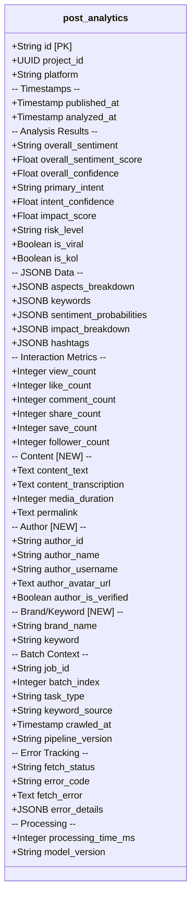
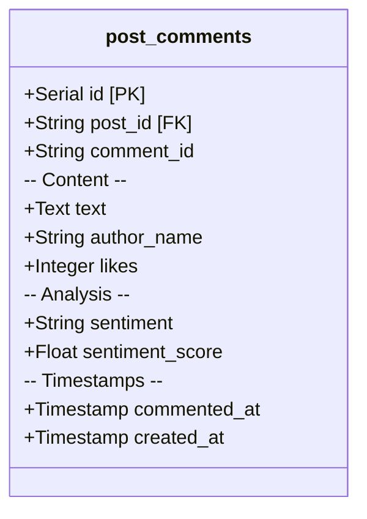
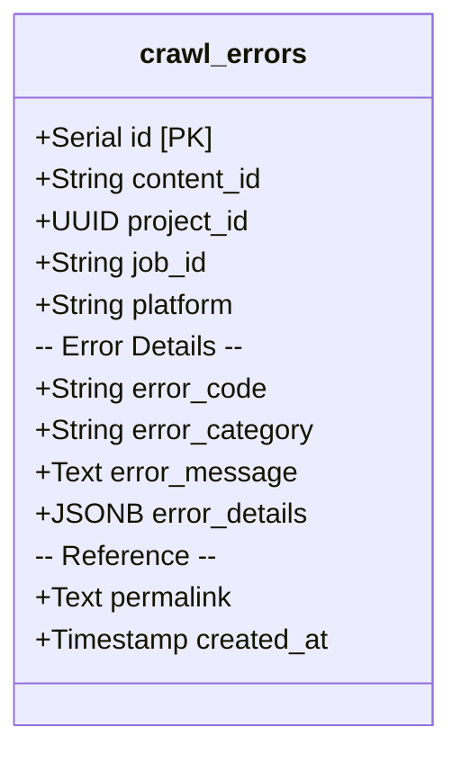
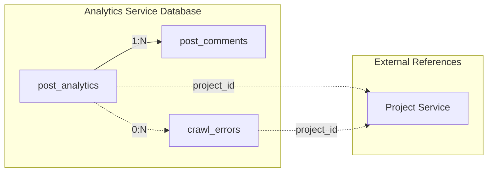
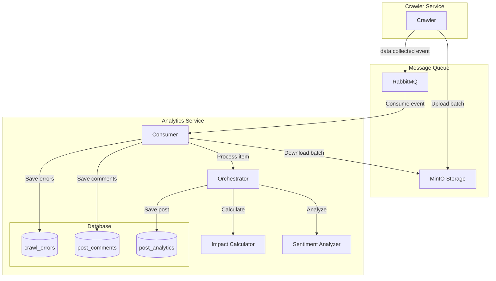
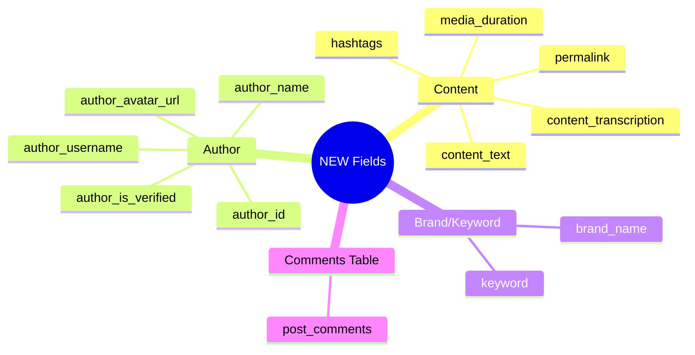
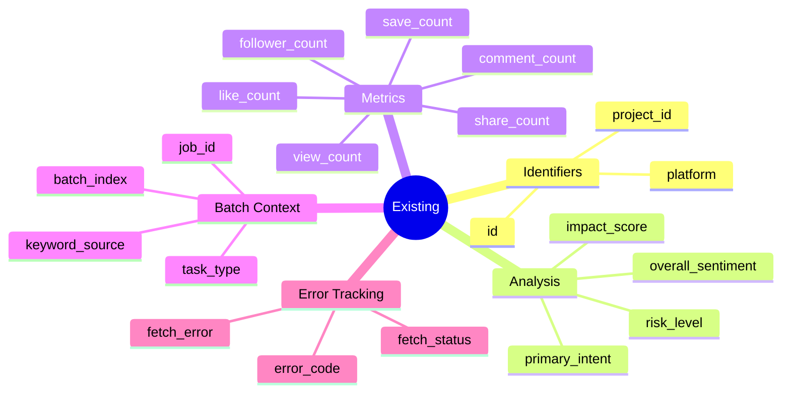

# Analytics Service - Entity Relationship Diagram

**Ngày tạo:** 2025-12-18  
**Mục đích:** Mô tả cấu trúc database của Analytics Service sau khi implement Contract v2.0

---

## 1. ERD Overview

```mermaid
erDiagram
    post_analytics ||--o{ post_comments : "has many"
    post_analytics ||--o{ crawl_errors : "may have"

    post_analytics {
        string id PK "Content ID từ platform"
        uuid project_id FK "UUID của project"
        string platform "TIKTOK | YOUTUBE"
        timestamp published_at "Thời gian publish"
        timestamp analyzed_at "Thời gian phân tích"

        string overall_sentiment "POSITIVE | NEGATIVE | NEUTRAL"
        float overall_sentiment_score "-1.0 to 1.0"
        float overall_confidence "0.0 to 1.0"

        string primary_intent "REVIEW | COMPLAINT | QUESTION..."
        float intent_confidence "0.0 to 1.0"

        float impact_score "0 to 100"
        string risk_level "LOW | MEDIUM | HIGH | CRITICAL"
        boolean is_viral "Viral detection"
        boolean is_kol "KOL detection"

        jsonb aspects_breakdown "Aspect-based sentiment"
        jsonb keywords "Extracted keywords"
        jsonb sentiment_probabilities "Sentiment probs"
        jsonb impact_breakdown "Impact calculation details"

        integer view_count "Số lượt xem"
        integer like_count "Số lượt like"
        integer comment_count "Số comments"
        integer share_count "Số lượt share"
        integer save_count "Số lượt save"
        integer follower_count "Followers của author"

        text content_text "Nội dung bài viết"
        text content_transcription "Transcription audio/video"
        integer media_duration "Thời lượng video (giây)"
        jsonb hashtags "Danh sách hashtags"
        text permalink "URL gốc của content"

        string author_id "Author ID từ platform"
        string author_name "Tên hiển thị"
        string author_username "Username/handle"
        text author_avatar_url "URL avatar"
        boolean author_is_verified "Verified account"

        string brand_name "Tên brand đang crawl"
        string keyword "Keyword đã search"

        string job_id "Job identifier"
        integer batch_index "Batch sequence number"
        string task_type "research_and_crawl"
        string keyword_source "Legacy keyword field"
        timestamp crawled_at "Thời gian crawl"
        string pipeline_version "crawler_tiktok_v3"

        string fetch_status "success | error"
        string error_code "Error code nếu có"
        text fetch_error "Error message"
        jsonb error_details "Chi tiết lỗi"

        integer processing_time_ms "Thời gian xử lý"
        string model_version "Model version"
    }

    post_comments {
        serial id PK "Auto increment ID"
        string post_id FK "FK to post_analytics"
        string comment_id "Comment ID từ platform"

        text text "Nội dung comment"
        string author_name "Tên người comment"
        integer likes "Số likes của comment"

        string sentiment "POSITIVE | NEGATIVE | NEUTRAL"
        float sentiment_score "-1.0 to 1.0"

        timestamp commented_at "Thời gian tạo comment"
        timestamp created_at "Thời gian lưu vào DB"
    }

    crawl_errors {
        serial id PK "Auto increment ID"
        string content_id "Content ID bị lỗi"
        uuid project_id FK "UUID của project"
        string job_id "Job identifier"
        string platform "TIKTOK | YOUTUBE"

        string error_code "Mã lỗi chuẩn"
        string error_category "Phân loại lỗi"
        text error_message "Mô tả lỗi"
        jsonb error_details "Chi tiết lỗi"

        text permalink "URL của content"
        timestamp created_at "Thời gian ghi nhận"
    }
```



---

## 2. Table Details

### 2.1. `post_analytics` - Main Analytics Table



### 2.2. `post_comments` - Comments Table (NEW)



### 2.3. `crawl_errors` - Error Tracking Table



---

## 3. Relationships



| Relationship              | Type | Description                                |
| ------------------------- | ---- | ------------------------------------------ |
| post_analytics → comments | 1:N  | Một post có nhiều comments                 |
| post_analytics → errors   | 0:N  | Một post có thể có error record (nếu fail) |
| post_analytics → project  | N:1  | Nhiều posts thuộc một project (external)   |

---

## 4. Indexes

### 4.1. `post_analytics` Indexes

| Index Name                        | Column(s)      | Purpose              |
| --------------------------------- | -------------- | -------------------- |
| `pk_post_analytics`               | `id`           | Primary key          |
| `idx_post_analytics_job_id`       | `job_id`       | Query by job         |
| `idx_post_analytics_fetch_status` | `fetch_status` | Filter success/error |
| `idx_post_analytics_task_type`    | `task_type`    | Filter by task type  |
| `idx_post_analytics_error_code`   | `error_code`   | Error analysis       |
| `idx_post_analytics_brand_name`   | `brand_name`   | 🆕 Filter by brand   |
| `idx_post_analytics_keyword`      | `keyword`      | 🆕 Filter by keyword |
| `idx_post_analytics_author_id`    | `author_id`    | 🆕 Group by author   |
| `idx_post_analytics_project_id`   | `project_id`   | Filter by project    |
| `idx_post_analytics_platform`     | `platform`     | Filter by platform   |
| `idx_post_analytics_published_at` | `published_at` | Time-series queries  |

### 4.2. `post_comments` Indexes

| Index Name                       | Column(s)      | Purpose             |
| -------------------------------- | -------------- | ------------------- |
| `pk_post_comments`               | `id`           | Primary key         |
| `idx_post_comments_post_id`      | `post_id`      | Join with post      |
| `idx_post_comments_sentiment`    | `sentiment`    | Filter by sentiment |
| `idx_post_comments_commented_at` | `commented_at` | Time-series queries |

### 4.3. `crawl_errors` Indexes

| Index Name                    | Column(s)    | Purpose             |
| ----------------------------- | ------------ | ------------------- |
| `pk_crawl_errors`             | `id`         | Primary key         |
| `idx_crawl_errors_project_id` | `project_id` | Filter by project   |
| `idx_crawl_errors_error_code` | `error_code` | Error analysis      |
| `idx_crawl_errors_created_at` | `created_at` | Time-series queries |
| `idx_crawl_errors_job_id`     | `job_id`     | Query by job        |

---

## 5. Data Flow



---

## 6. Field Groups (NEW vs Existing)

### 🆕 NEW Fields (Contract v2.0)



### ✅ Existing Fields



---

## 7. Sample Queries

### Query posts by brand and keyword

```sql
SELECT id, content_text, author_name, overall_sentiment, impact_score
FROM post_analytics
WHERE project_id = 'uuid-here'
  AND brand_name = 'VinFast'
  AND keyword = 'VinFast VF8'
ORDER BY published_at DESC
LIMIT 50;
```

### Query posts with comments

```sql
SELECT
    p.id,
    p.content_text,
    p.author_name,
    COUNT(c.id) as comment_count,
    AVG(c.sentiment_score) as avg_comment_sentiment
FROM post_analytics p
LEFT JOIN post_comments c ON p.id = c.post_id
WHERE p.project_id = 'uuid-here'
GROUP BY p.id
ORDER BY p.impact_score DESC;
```

### Aggregate by brand

```sql
SELECT
    brand_name,
    COUNT(*) as post_count,
    AVG(impact_score) as avg_impact,
    SUM(view_count) as total_views
FROM post_analytics
WHERE project_id = 'uuid-here'
GROUP BY brand_name;
```
