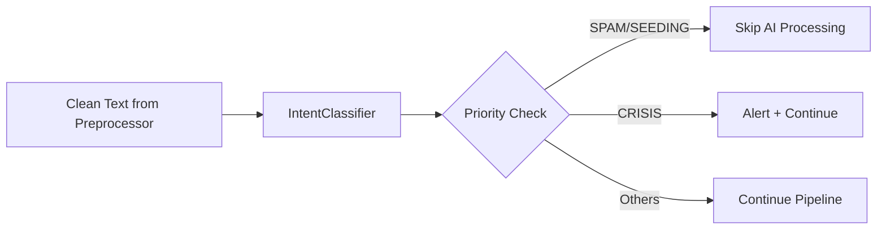

# Implement Intent Classifier

**Change ID**: `implement_intent_classifier`  
**Status**: Proposal  
**Created**: 2025-11-30  
**Author**: Analytics Engine Team

---

## Why

After completing the TextPreprocessor (Module 1), we need Module 2 of the AI processing pipeline: **Intent Classification**. This module serves as a critical **gatekeeper** that:

1. **Filters Noise Early**: Detects SPAM/SEEDING posts before expensive AI processing (PhoBERT/SpaCy)
2. **Prioritizes Processing**: Identifies CRISIS posts that need immediate attention
3. **Enriches Analytics**: Classifies user intent (LEAD, COMPLAINT, SUPPORT) for business intelligence

**Current Gap**: Without intent classification, the pipeline processes ALL posts through PhoBERT (~50ms each), wasting resources on spam. We need a fast (\<1ms) rule-based filter to skip 30-40% of noise posts.

**Business Impact**:
- **Cost Reduction**: Skip AI processing for 30-40% spam posts → Save ~$500/month in compute
- **Speed**: Reduce p95 latency from 2s to \<1s by early filtering
- **Crisis Detection**: Flag critical posts (tẩy chay, lừa đảo) within 1 hour instead of 24h

---

## What Changes

### Module Implementation
- **New File**: `services/analytics/intent/intent_classifier.py`
  - `IntentClassifier` class with regex-based classification
  - 7 intent categories: CRISIS, SEEDING, SPAM, COMPLAINT, LEAD, SUPPORT, DISCUSSION
  - Priority-based conflict resolution
  - Vietnamese-optimized patterns

### Configuration
- **Update**: `core/config.py`
  - Add intent classifier settings (min_confidence, enable_skip_logic)
  - **New**: `config/intent_patterns.yaml` - Externalize regex patterns for hot-reloading

### Testing
- **New Files**: 
  - `tests/intent/test_unit.py` - Unit tests for pattern matching
  - `tests/intent/test_integration.py` - Integration with real Vietnamese text
  - `tests/intent/test_performance.py` - Performance benchmarks (\<1ms target)
- **New Cases**:
  - Native Ads (Seeding trá hình)
  - Sarcasm (Complaint mỉa mai)
  - Support vs Lead distinction
  - Unsigned Spam (Spam không dấu)

### Documentation
- **Update**: `README.md` - Add Intent Classifier section
- **New**: `examples/intent_example.py` - Usage demonstration

### Integration
- Ready for Orchestrator to call after TextPreprocessor

---

## Problem

In the Analytics Service pipeline (see `documents/master-proposal.md`), the processing flow is:

```
Raw JSON → Preprocessor → Intent → Keyword → Sentiment → Impact → DB
```

Currently, we have:
- ✅ **Extra Module**: Keyword Extraction (SpaCy-YAKE completed)
- ✅ **Extra Module**: Sentiment Analysis (PhoBERT completed)
- ✅ **Module 1**: TextPreprocessor (completed)
- ❌ **Module 2**: Intent Classifier (MISSING)


**Without Module 2**, the pipeline has critical issues:

1. **Resource Waste**: All posts go through PhoBERT (~50ms each), including spam
   - Example: "Bán sim giá rẻ 0912345678" still gets sentiment analysis
   
2. **No Crisis Alerting**: Cannot detect urgent posts (tẩy chay, lừa đảo) early
   - Example: "VinFast lừa đảo khách hàng" treated same as normal discussion

3. **Missing Business Context**: No intent labels for Dashboard/Reports
   - Cannot answer: "How many LEAD posts this week?"

---

## Proposed Solution

Implement `IntentClassifier` as a **rule-based (regex) module** that classifies posts into 7 intent categories.

### Architecture



### Intent Taxonomy

| Intent | Priority | Description | Action |
|--------|----------|-------------|--------|
| **CRISIS** | 10 | Khủng hoảng (tẩy chay, lừa đảo, scam) | Alert + Process |
| **SEEDING** | 9 | Spam marketing (phone numbers, sales) | **SKIP** |
| **SPAM** | 9 | Garbage (vay tiền, bán sim) | **SKIP** |
| **COMPLAINT** | 7 | Phàn nàn sản phẩm/dịch vụ | Flag + Process |
| **LEAD** | 5 | Sales opportunity (hỏi giá, mua xe) | Flag + Process |
| **SUPPORT** | 4 | Technical support needed | Flag + Process |
| **DISCUSSION** | 1 | Normal discussion (default) | Process |

### Technical Design

**Class Interface**:
```python
class IntentClassifier:
    def __init__(self):
        # Pre-compile regex patterns for performance
        pass
    
    def predict(self, text: str) -> Dict[str, Any]:
        """
        Classify intent using regex patterns.
        
        Returns:
            {
                "intent": "COMPLAINT",
                "confidence": 0.9,
                "should_skip": False,
                "matched_pattern": "lỗi.*không.*sửa"
            }
        """
        pass
```

**Pattern Examples** (Vietnamese):
```python
PATTERNS = {
    "CRISIS": [
        r"tẩy chay",
        r"lừa.*đảo",
        r"scam",
        r"phốt",
        r"bóc.*phốt"
    ],
    "SEEDING": [
        r"\d{9,11}",  # Phone numbers
        r"zalo.*\d{9}",
        r"inbox.*giá",
        r"liên hệ.*mua"
    ],
    "COMPLAINT": [
        r"lỗi.*(không|chưa).*sửa",
        r"thất vọng",
        r"tệ.*quá",
        r"đừng.*mua"
    ],
    "LEAD": [
        r"giá.*bao.*nhiêu",
        r"mua.*ở.*đâu",
        r"test.*drive",
        r"xin.*giá"
    ]
}
```

---

## Scope

### In Scope
- ✅ Implement `IntentClassifier` class in `services/analytics/intent/`
- ✅ Define 7 intent categories with Vietnamese regex patterns
- ✅ Priority-based conflict resolution
- ✅ Unit tests (pattern matching, priority logic)
- ✅ Integration tests (real Vietnamese text)
- ✅ Performance tests (\<1ms target)
- ✅ Configuration in `core/config.py`
- ✅ Documentation and examples

### Out of Scope
- ❌ Machine Learning models (future: Phase 2)
- ❌ Multi-language support (English, Thai) - focus on Vietnamese only
- ❌ Orchestrator integration (will be done in separate change)
- ❌ Database schema changes

---

## Success Criteria

### Functional Requirements
- [ ] Correctly classifies 7 intent types on test dataset
- [ ] Priority conflict resolution works (CRISIS > SEEDING > COMPLAINT > LEAD)
- [ ] `should_skip` flag correctly set for SPAM/SEEDING
- [ ] Handles edge cases (empty text, no matches)
- [ ] Vietnamese patterns match real social media text
- [ ] **Refinement**: Handles Native Ads (Seeding) correctly
- [ ] **Refinement**: Handles Sarcasm (Complaint) correctly (or fails gracefully)
- [ ] **Refinement**: Distinguishes Support vs Lead
- [ ] **Refinement**: Detects Unsigned Spam
- [ ] **Refinement**: Patterns loaded from external config file

### Non-Functional Requirements
- [ ] Processing time \<1ms per text (regex is fast)
- [ ] Unit test coverage >90%
- [ ] Integration tests with real Vietnamese posts
- [ ] Performance benchmarks documented
- [ ] Well-documented with usage examples

---

## Implementation Plan

See `tasks.md` for detailed breakdown.

**Estimated Effort**: 2-3 days

**Phases**:
1. Core Implementation (1 day)
2. Testing (1 day)
3. Documentation & Integration (0.5 day)
4. Validation & Cleanup (0.5 day)

---

## Dependencies

### Required
- ✅ Python 3.12+
- ✅ Standard library (`re`, `enum`, `typing`)
- ✅ TextPreprocessor (Module 1) - completed

### Blocked By
- None

### Blocks
- Orchestrator implementation (needs intent classification to decide skip logic)
- Full analytics pipeline (Module 2 is required for end-to-end flow)

---

## Risks & Mitigations

| Risk | Impact | Mitigation |
|------|--------|------------|
| Regex patterns miss edge cases | Medium | Comprehensive test suite with real data |
| False positives (normal posts marked as SPAM) | High | Conservative patterns + manual review of test results |
| Vietnamese language complexity | Medium | Collaborate with Vietnamese speakers for pattern validation |
| Performance degradation with many patterns | Low | Pre-compile regex + benchmark tests |

---

## Alternatives Considered

### Alternative 1: Machine Learning Model
**Rejected**: Overkill for initial version. Rule-based is:
- Faster (\<1ms vs ~50ms)
- More interpretable (can explain why post is SPAM)
- Easier to maintain (just update patterns)
- Good enough for 80% accuracy

ML can be added in Phase 2 if needed.

### Alternative 2: External Service (e.g., Google Perspective API)
**Rejected**: 
- Cost ($1 per 1000 requests)
- Latency (network call ~100ms)
- Not optimized for Vietnamese
- Privacy concerns (sending data to Google)

### Alternative 3: No Intent Classification
**Rejected**: 
- Wastes 30-40% compute on spam
- No crisis detection
- Missing business intelligence

---

## References

- Master Proposal: `documents/master-proposal.md` (Section 4.2)
- Implementation Plan: `documents/implement_plan.md` (Phase 1.2)
- Term Document: `term.md` (Intent Classifier specification)
- TextPreprocessor: `openspec/specs/text_preprocessing/spec.md`
