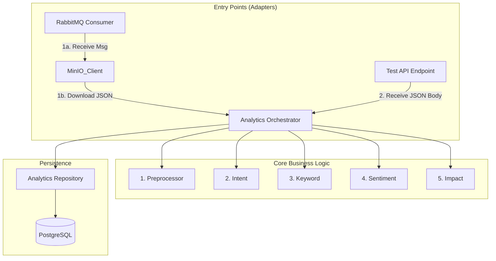

# PROPOSAL: IMPLEMENT ANALYTICS ORCHESTRATOR & ENTRY POINTS

**Module:** Core Orchestration
**Status:** Ready for Implementation
**Target Files:**

1.  `src/services/analytics/orchestrator.py` (Logic trung tâm)
2.  `src/entrypoints/consumer.py` (Luồng Production)
3.  `src/entrypoints/api.py` (Luồng Dev/Test)
4.  `src/adapters/storage/minio_client.py` (Hạ tầng)

## 1\. Kiến trúc Tổng thể (High-Level Architecture)

Chúng ta sử dụng mô hình **Hexagonal Architecture** (Ports & Adapters). `AnalyticsOrchestrator` nằm ở giữa, không quan tâm dữ liệu đến từ Queue hay API, miễn là đúng format JSON.

[Image of analytics pipeline data flow]



---

## 2\. Thiết kế Chi tiết (Implementation Details)

### 2.1. MinIO Adapter (Cầu nối dữ liệu)

Cần một client để tải file JSON từ "Kho" về "Nhà máy" dựa trên tín hiệu từ Queue.

**File:** `src/adapters/storage/minio_client.py`

```python
import json
from minio import Minio
from src.core.config import settings

class MinioAdapter:
    def __init__(self):
        self.client = Minio(
            settings.MINIO_ENDPOINT,
            access_key=settings.MINIO_ACCESS_KEY,
            secret_key=settings.MINIO_SECRET_KEY,
            secure=False
        )

    def download_json(self, bucket: str, object_path: str) -> dict:
        """
        Stream file từ MinIO về RAM và parse thành Dict.
        Không lưu temp file để tối ưu tốc độ.
        """
        try:
            response = self.client.get_object(bucket, object_path)
            data = json.load(response)
            response.close()
            response.release_conn()
            return data
        except Exception as e:
            raise Exception(f"Failed to fetch from MinIO: {str(e)}")
```

---

### 2.2. The Orchestrator (Trái tim hệ thống)

Đây là class duy nhất chứa logic phối hợp 5 module. Nó nhận vào `post_data` (Dict) và trả về kết quả đã xử lý.

**File:** `src/services/analytics/orchestrator.py`

```python
import logging
from sqlalchemy.orm import Session
# Import 5 modules & Repo (như đã có)

logger = logging.getLogger(__name__)

class AnalyticsOrchestrator:
    def __init__(self, db: Session, phobert_model):
        self.db = db
        # Init 5 Modules (Singleton Instances)
        self.preprocessor = TextPreprocessor()
        self.intent_classifier = IntentClassifier()
        self.keyword_extractor = KeywordExtractor()
        self.sentiment_analyzer = SentimentAnalyzer(phobert_model)
        self.impact_calculator = ImpactCalculator()
        self.repo = AnalyticsRepository(db)

    def process_post(self, post_data: dict) -> dict:
        """
        Hàm xử lý trung tâm.
        Input: Atomic JSON của 1 bài viết.
        Output: Kết quả phân tích đã lưu DB.
        """
        post_id = post_data.get('meta', {}).get('id')
        logger.info(f"🚀 Starting pipeline for post: {post_id}")

        # --- STEP 1: PREPROCESS ---
        prep_result = self.preprocessor.process(post_data)
        clean_text = prep_result['clean_text']

        # --- STEP 2: INTENT (GATEKEEPER) ---
        intent_result = self.intent_classifier.predict(clean_text)

        # Logic lọc rác kết hợp (Signal từ Module 1 + Module 2)
        is_spam_signal = prep_result['stats'].get('has_spam_keyword', False)
        if is_spam_signal or intent_result['should_skip']:
            logger.info(f"⛔ Skipped SPAM/SEEDING post: {post_id}")
            return self._save_skipped_result(post_data, intent_result)

        # --- STEP 3: KEYWORD EXTRACTION ---
        keywords = self.keyword_extractor.extract(clean_text)

        # --- STEP 4: SENTIMENT ANALYSIS ---
        sentiment_result = self.sentiment_analyzer.analyze(clean_text, keywords)

        # --- STEP 5: IMPACT CALCULATION ---
        impact_result = self.impact_calculator.calculate(
            interaction=post_data.get('interaction', {}),
            author=post_data.get('author', {}),
            sentiment_result=sentiment_result['overall'],
            platform=post_data.get('meta', {}).get('platform', 'UNKNOWN')
        )

        # --- STEP 6: ASSEMBLY & SAVE ---
        final_result = {
            "id": post_id,
            "project_id": post_data['meta']['project_id'],
            # ... map các trường khác ...
            "overall_sentiment": sentiment_result['overall']['label'],
            "impact_score": impact_result['score'],
            # ...
        }

        self.repo.save(final_result)
        logger.info(f"✅ Successfully processed post: {post_id}")
        return final_result

    def _save_skipped_result(self, post_data, intent_result):
        # Lưu vào DB nhưng đánh dấu là skipped/spam
        pass
```

---

### 2.3. Entry Point 1: RabbitMQ Consumer (Production Flow)

Luồng này lắng nghe Queue, lấy path, gọi MinIO, rồi ném cục JSON vào Orchestrator.

**File:** `src/entrypoints/consumer.py`

```python
import json
from src.adapters.storage.minio_client import MinioAdapter
from src.services.analytics.orchestrator import AnalyticsOrchestrator

def callback(ch, method, properties, body):
    try:
        # 1. Parse Message từ Queue
        msg = json.loads(body)
        bucket = msg['data_ref']['bucket']
        path = msg['data_ref']['path']

        print(f"📥 Received Job for: {path}")

        # 2. Lấy JSON từ MinIO
        minio_adapter = MinioAdapter()
        post_data = minio_adapter.download_json(bucket, path)

        # 3. Gọi Orchestrator xử lý
        # (Giả sử db_session và model đã được init global hoặc inject vào)
        orchestrator = AnalyticsOrchestrator(db_session, phobert_model)
        orchestrator.process_post(post_data)

        # 4. Acknowledge (Xác nhận thành công)
        ch.basic_ack(delivery_tag=method.delivery_tag)

    except Exception as e:
        print(f"❌ Error processing message: {e}")
        # Nack để queue gửi lại sau (hoặc đẩy vào DLQ)
        ch.basic_nack(delivery_tag=method.delivery_tag, requeue=False)
```

---

### 2.4. Entry Point 2: REST API (Dev/Test Flow)

Luồng này nhận JSON trực tiếp từ Body, bỏ qua MinIO. Cực tiện để debug logic AI mà không cần upload file.

**File:** `src/entrypoints/api.py`

```python
from fastapi import APIRouter, Depends
from src.services.analytics.orchestrator import AnalyticsOrchestrator

router = APIRouter()

@router.post("/dev/process-post-direct")
async def dev_process_post_direct(
    post_data: dict,  # Nhận nguyên cục JSON Atomic
    orchestrator: AnalyticsOrchestrator = Depends(get_orchestrator)
):
    """
    API dành cho Dev/Test.
    Input: JSON bài viết (không cần upload MinIO).
    Output: Kết quả phân tích (đã lưu DB).
    """
    try:
        result = orchestrator.process_post(post_data)
        return {
            "status": "SUCCESS",
            "data": result
        }
    except Exception as e:
        return {
            "status": "FAILED",
            "error": str(e)
        }
```

---

## 3\. Kế hoạch Kiểm thử (Testing Plan)

### Case 1: Test API Flow (Dễ nhất)

1.  Mở Postman / Swagger UI.
2.  Gọi `POST /dev/process-post-direct`.
3.  Paste nội dung file `examples/sample_post.json` vào body.
4.  Bấm Send.
5.  **Kỳ vọng:** Nhận về JSON kết quả phân tích đầy đủ. Check DB thấy có record mới.

### Case 2: Test Production Flow (Integration)

1.  Upload thủ công 1 file `test.json` lên MinIO bucket `raw-data`.
2.  Vào RabbitMQ Management UI, publish thủ công 1 message vào queue `analytics.process.queue`:
    ```json
    {
      "data_ref": {
        "bucket": "raw-data",
        "path": "test.json"
      }
    }
    ```
3.  **Kỳ vọng:** Consumer log ra dòng "📥 Received Job...", sau đó "✅ Successfully processed". Check DB thấy record.

---

### Kết luận

Với Proposal này, bạn có một hệ thống **Linh hoạt tuyệt đối**:

- **Production:** Chạy Async qua Queue, Scale thoải mái.
- **Development:** Chạy Sync qua API, Debug lỗi logic ngay lập tức mà không cần setup Queue/MinIO phức tạp mỗi lần test một case nhỏ.

Hãy đưa proposal này cho Agent để hoàn thiện mảnh ghép cuối cùng\!
