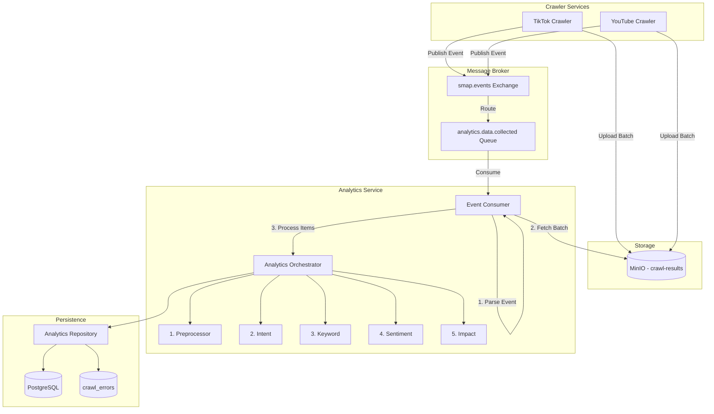
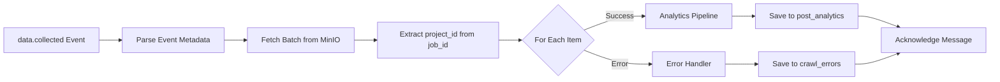

# Analytics Orchestrator & Entry Points

**Module:** Core Orchestration
**Status:** ✅ Implemented (Updated: 2025-12-07)
**Target Files:**

1.  `services/analytics/orchestrator.py` (Logic trung tâm)
2.  `internal/consumers/main.py` (Event Consumer - Production)
3.  `infrastructure/storage/minio_client.py` (Hạ tầng)

## 1\. Kiến trúc Tổng thể (High-Level Architecture)

Chúng ta sử dụng mô hình **Hexagonal Architecture** (Ports & Adapters). `AnalyticsOrchestrator` nằm ở giữa, không quan tâm dữ liệu đến từ Queue hay API, miễn là đúng format JSON.

### Event-Driven Architecture (Production)

Analytics Service hiện tại sử dụng kiến trúc event-driven để consume `data.collected` events từ Crawler services:



### Event Schema

```json
{
  "event_id": "evt_abc123",
  "event_type": "data.collected",
  "timestamp": "2025-12-06T10:15:30Z",
  "payload": {
    "minio_path": "crawl-results/tiktok/proj_xyz/brand/batch_000.json",
    "project_id": "proj_xyz",
    "job_id": "proj_xyz-brand-0",
    "batch_index": 1,
    "content_count": 50,
    "platform": "tiktok",
    "task_type": "research_and_crawl",
    "keyword": "VinFast VF8"
  }
}
```

### Batch Processing Flow



---

## 2\. Thiết kế Chi tiết (Implementation Details)

### 2.1. MinIO Adapter (Cầu nối dữ liệu)

MinIO Adapter hỗ trợ cả single JSON và batch JSON array từ Crawler services.

**File:** `infrastructure/storage/minio_client.py`

```python
from typing import Any, Dict, List, Union
from minio import Minio
from core.config import settings

class MinioAdapter:
    def __init__(self):
        self.client = Minio(
            settings.minio_endpoint.replace("http://", "").replace("https://", ""),
            access_key=settings.minio_access_key,
            secret_key=settings.minio_secret_key,
            secure=settings.minio_endpoint.startswith("https")
        )

    def download_json(self, bucket: str, object_path: str) -> Union[Dict[str, Any], List[Dict[str, Any]]]:
        """
        Download và parse JSON từ MinIO.
        Hỗ trợ cả dict (single item) và list (batch items).
        """
        response = self.client.get_object(bucket, object_path)
        content = response.read()
        response.close()
        response.release_conn()

        # Handle compression if needed
        if self._is_compressed(response.headers):
            content = self._decompress(content)

        return json.loads(content)

    def download_batch(self, bucket: str, object_path: str) -> List[Dict[str, Any]]:
        """
        Download batch data từ MinIO.
        Luôn trả về List[Dict] - wrap single object nếu cần.
        """
        data = self.download_json(bucket, object_path)

        if isinstance(data, list):
            return data
        elif isinstance(data, dict):
            return [data]
        else:
            raise MinioAdapterError(f"Unexpected data type: {type(data)}")

    def _is_compressed(self, headers: dict) -> bool:
        """Check if content is compressed (supports both Analytics and Crawler formats)."""
        # Crawler format: x-amz-meta-compressed: "true"
        if headers.get("x-amz-meta-compressed", "").lower() == "true":
            return True
        # Analytics format: compression-algorithm: "zstd"
        if headers.get("x-amz-meta-compression-algorithm") == "zstd":
            return True
        return False
```

---

### 2.2. The Orchestrator (Trái tim hệ thống)

Đây là class duy nhất chứa logic phối hợp 5 module. Nó nhận vào `post_data` (Dict) và trả về kết quả đã xử lý.

**File:** `services/analytics/orchestrator.py`

```python
import logging
from typing import Optional, Dict, Any
from sqlalchemy.orm import Session

from repository.analytics_repository import AnalyticsRepository
from services.analytics.preprocessor import TextPreprocessor
from services.analytics.intent import IntentClassifier
from services.analytics.keyword import KeywordExtractor
from services.analytics.sentiment import SentimentAnalyzer
from services.analytics.impact import ImpactCalculator

logger = logging.getLogger(__name__)

class AnalyticsOrchestrator:
    def __init__(self, repository: AnalyticsRepository, sentiment_analyzer: Optional[SentimentAnalyzer] = None):
        self.repository = repository
        # Init 5 Modules
        self.preprocessor = TextPreprocessor()
        self.intent_classifier = IntentClassifier()
        self.keyword_extractor = KeywordExtractor()
        self.sentiment_analyzer = sentiment_analyzer
        self.impact_calculator = ImpactCalculator()

    def process_post(self, post_data: dict) -> dict:
        """
        Hàm xử lý trung tâm.
        Input: Atomic JSON của 1 bài viết (có thể enriched với batch context).
        Output: Kết quả phân tích đã lưu DB.
        """
        meta = post_data.get('meta', {})
        post_id = meta.get('id', 'unknown')
        platform = meta.get('platform', 'UNKNOWN')

        # Batch context (từ crawler event integration)
        job_id = meta.get('job_id')
        batch_index = meta.get('batch_index')
        project_id = meta.get('project_id')

        logger.info(f"🚀 Starting pipeline for post: {post_id}, job_id={job_id}")

        # --- STEP 1: PREPROCESS ---
        prep_result = self.preprocessor.process(post_data)
        clean_text = prep_result['clean_text']

        # --- STEP 2: INTENT (GATEKEEPER) ---
        intent_result = self.intent_classifier.predict(clean_text)

        # Logic lọc rác kết hợp (Signal từ Module 1 + Module 2)
        is_spam_signal = prep_result['stats'].get('has_spam_keyword', False)
        if is_spam_signal or intent_result.get('should_skip', False):
            logger.info(f"⛔ Skipped SPAM/SEEDING post: {post_id}")
            return self._save_skipped_result(post_data, intent_result)

        # --- STEP 3: KEYWORD EXTRACTION ---
        keywords = self.keyword_extractor.extract(clean_text)

        # --- STEP 4: SENTIMENT ANALYSIS ---
        sentiment_result = {}
        if self.sentiment_analyzer:
            sentiment_result = self.sentiment_analyzer.analyze(clean_text, keywords)

        # --- STEP 5: IMPACT CALCULATION ---
        impact_result = self.impact_calculator.calculate(
            interaction=post_data.get('interaction', {}),
            author=post_data.get('author', {}),
            sentiment_result=sentiment_result.get('overall', {}),
            platform=platform
        )

        # --- STEP 6: ASSEMBLY & SAVE ---
        final_result = {
            "id": post_id,
            "project_id": project_id,
            "platform": platform,
            # Batch context
            "job_id": job_id,
            "batch_index": batch_index,
            "task_type": meta.get('task_type'),
            "keyword_source": meta.get('keyword_source'),
            "crawled_at": meta.get('crawled_at'),
            "pipeline_version": meta.get('pipeline_version'),
            # Analytics results
            "overall_sentiment": sentiment_result.get('overall', {}).get('label', 'NEUTRAL'),
            "impact_score": impact_result.get('score', 0.0),
            "risk_level": impact_result.get('risk_level', 'LOW'),
            # ...
        }

        self.repository.save(final_result)
        logger.info(f"✅ Successfully processed post: {post_id}")
        return final_result

    def _save_skipped_result(self, post_data: dict, intent_result: dict) -> dict:
        """Lưu vào DB nhưng đánh dấu là skipped/spam."""
        meta = post_data.get('meta', {})
        result = {
            "id": meta.get('id'),
            "project_id": meta.get('project_id'),
            "platform": meta.get('platform'),
            "job_id": meta.get('job_id'),
            "batch_index": meta.get('batch_index'),
            "overall_sentiment": "NEUTRAL",
            "impact_score": 0.0,
            "is_skipped": True,
            "skip_reason": intent_result.get('intent', 'SPAM'),
        }
        self.repository.save(result)
        return result
```

---

### 2.3. Entry Point 1: Event Consumer (Production Flow)

Luồng này consume `data.collected` events từ `smap.events` exchange, fetch batch từ MinIO, và xử lý từng item qua Orchestrator.

**File:** `internal/consumers/main.py`

```python
import json
from typing import Any, Dict, Optional
from aio_pika import IncomingMessage
from sqlalchemy import create_engine
from sqlalchemy.orm import sessionmaker

from core.config import settings
from core.logger import logger
from infrastructure.storage.minio_client import MinioAdapter
from repository.analytics_repository import AnalyticsRepository
from repository.crawl_error_repository import CrawlErrorRepository
from services.analytics.orchestrator import AnalyticsOrchestrator
from utils.project_id_extractor import extract_project_id


def parse_minio_path(minio_path: str) -> tuple[str, str]:
    """Parse MinIO path into bucket and object path."""
    parts = minio_path.split("/", 1)
    return parts[0], parts[1]


def validate_event_format(envelope: dict) -> bool:
    """Validate that envelope is a valid data.collected event."""
    if "payload" not in envelope:
        return False
    return "minio_path" in envelope["payload"]


async def message_handler(message: IncomingMessage) -> None:
    """Process incoming data.collected event from RabbitMQ."""
    async with message.process():
        try:
            # 1. Parse Event
            envelope = json.loads(message.body.decode("utf-8"))

            if not validate_event_format(envelope):
                raise ValueError("Invalid event format")

            payload = envelope["payload"]
            event_id = envelope.get("event_id", "unknown")
            minio_path = payload["minio_path"]
            job_id = payload.get("job_id", "")

            logger.info(f"📥 Processing event: {event_id}, job_id={job_id}")

            # 2. Fetch Batch từ MinIO
            minio_adapter = MinioAdapter()
            bucket, object_path = parse_minio_path(minio_path)
            batch_items = minio_adapter.download_batch(bucket, object_path)

            logger.info(f"📦 Fetched {len(batch_items)} items from MinIO")

            # 3. Extract project_id từ job_id
            project_id = extract_project_id(job_id) or payload.get("project_id")

            # 4. Process từng item trong batch
            with db_session() as db:
                analytics_repo = AnalyticsRepository(db)
                error_repo = CrawlErrorRepository(db)

                success_count = 0
                error_count = 0

                for item in batch_items:
                    result = process_single_item(
                        item=item,
                        event_metadata=payload,
                        project_id=project_id,
                        analytics_repo=analytics_repo,
                        error_repo=error_repo,
                    )

                    if result["status"] == "success":
                        success_count += 1
                    else:
                        error_count += 1

            logger.info(f"✅ Batch completed: success={success_count}, errors={error_count}")

        except Exception as e:
            logger.error(f"❌ Error processing event: {e}")
            raise


def process_single_item(item: dict, event_metadata: dict, project_id: Optional[str],
                        analytics_repo: AnalyticsRepository, error_repo: CrawlErrorRepository) -> dict:
    """Process a single item from batch."""
    meta = item.get("meta", {})
    fetch_status = meta.get("fetch_status", "success")

    # Handle error items
    if fetch_status == "error":
        error_repo.save({
            "content_id": meta.get("id"),
            "project_id": project_id,
            "job_id": event_metadata.get("job_id"),
            "platform": meta.get("platform"),
            "error_code": meta.get("error_code", "UNKNOWN_ERROR"),
            "error_message": meta.get("error_message", ""),
        })
        return {"status": "error", "error_code": meta.get("error_code")}

    # Handle success items
    enriched_item = enrich_with_batch_context(item, event_metadata, project_id)
    orchestrator = AnalyticsOrchestrator(repository=analytics_repo)
    orchestrator.process_post(enriched_item)

    return {"status": "success"}
```

---

## 3\. Kế hoạch Kiểm thử (Testing Plan)

### Case 1: Test Event-Driven Flow (Integration)

1.  Upload batch file lên MinIO bucket `crawl-results`:

    ```bash
    mc cp test_batch.json minio/crawl-results/tiktok/test_project/brand/batch_000.json
    ```

2.  Vào RabbitMQ Management UI, publish message vào exchange `smap.events` với routing key `data.collected`:

    ```json
    {
      "event_id": "evt_test_001",
      "event_type": "data.collected",
      "timestamp": "2025-12-07T10:00:00Z",
      "payload": {
        "minio_path": "crawl-results/tiktok/test_project/brand/batch_000.json",
        "project_id": "test_project",
        "job_id": "test_project-brand-0",
        "batch_index": 1,
        "content_count": 2,
        "platform": "tiktok"
      }
    }
    ```

3.  **Kỳ vọng:** Consumer log ra:
    - "📥 Processing event: evt_test_001"
    - "📦 Fetched 2 items from MinIO"
    - "✅ Batch completed: success=2, errors=0"
    - Check DB thấy records trong `post_analytics` table.

### Case 2: Test Error Handling

1.  Upload batch với error items:

    ```json
    [
      {"meta": {"id": "success_001", "fetch_status": "success"}, "content": {...}},
      {"meta": {"id": "error_001", "fetch_status": "error", "error_code": "CONTENT_REMOVED"}}
    ]
    ```

2.  Publish event như Case 2.

3.  **Kỳ vọng:**
    - Success item được lưu vào `post_analytics`
    - Error item được lưu vào `crawl_errors`
    - Batch vẫn complete (không crash)

---

## 4\. Configuration

### Environment Variables

```bash
# Event Queue (Production)
EVENT_EXCHANGE=smap.events
EVENT_ROUTING_KEY=data.collected
EVENT_QUEUE_NAME=analytics.data.collected

# Batch Processing
MAX_CONCURRENT_BATCHES=5
BATCH_TIMEOUT_SECONDS=30
EXPECTED_BATCH_SIZE_TIKTOK=50
EXPECTED_BATCH_SIZE_YOUTUBE=20

# MinIO
MINIO_ENDPOINT=http://localhost:9000
MINIO_ACCESS_KEY=minioadmin
MINIO_SECRET_KEY=minioadmin
MINIO_CRAWL_RESULTS_BUCKET=crawl-results
```

---

## 5\. Error Handling

### Error Categories

| Category      | Error Codes                              | Action             |
| ------------- | ---------------------------------------- | ------------------ |
| rate_limiting | RATE_LIMITED, AUTH_FAILED, ACCESS_DENIED | Retry with backoff |
| content       | CONTENT_REMOVED, CONTENT_NOT_FOUND       | Skip permanently   |
| network       | NETWORK_ERROR, TIMEOUT                   | Retry              |
| parsing       | PARSE_ERROR, INVALID_URL                 | Alert team         |
| storage       | STORAGE_ERROR, UPLOAD_FAILED             | Retry              |

### Graceful Error Handling

- Per-item failures **không** crash entire batch
- Error items được log và lưu vào `crawl_errors` table
- Batch vẫn được ack sau khi xử lý xong

---

## 6\. Performance Targets

| Metric               | Target         |
| -------------------- | -------------- |
| Batch processing p95 | < 5 seconds    |
| Throughput (TikTok)  | 1000 items/min |
| Throughput (YouTube) | 300 items/min  |
| Success rate         | > 95%          |

---

### Kết luận

Với kiến trúc Event-Driven này, hệ thống có:

- **Production:** Consume events từ `smap.events`, batch processing 20-50 items/message
- **Resilience:** Per-item error handling, graceful degradation
- **Observability:** Structured logging với event_id correlation

Xem thêm:

- `document/analytics-service-behavior.md` - Chi tiết behavior của service
- `document/analytics-service-integration-guide.md` - Hướng dẫn integration
