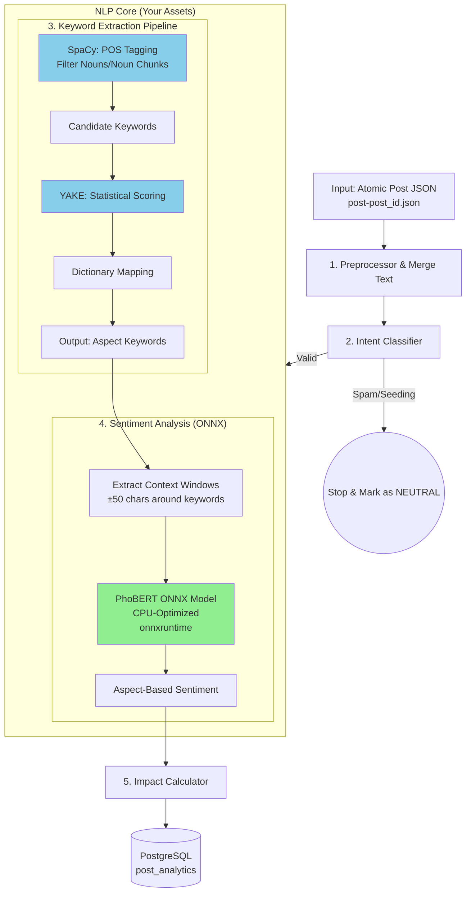

# PROPOSAL: ANALYTICS SERVICE

## Social Media Intelligence Engine for Brand Monitoring

**Version:** 1.0  
**Date:** November 29, 2025  
**Status:** Ready for Implementation  
**Author:** Tan Tai

---

## EXECUTIVE SUMMARY

Analytics Service là module xử lý trí tuệ nhân tạo (AI/ML) trong hệ sinh thái Social Media Monitoring Platform, chịu trách nhiệm chuyển đổi **raw social data** (từ MinIO) thành **actionable business intelligence** (PostgreSQL + Dashboard).

### Key Value Propositions

| Traditional Analytics     | Our Analytics Service                                                           |
| ------------------------- | ------------------------------------------------------------------------------- |
| "You have 1,000 mentions" | "You have 347 high-impact complaints about battery life"                        |
| "70% positive sentiment"  | "Design praised (85%) but price criticized (92%) - blocking conversions"        |
| "Trending on TikTok"      | "Crisis detected: viral negative post (150K views) from KOL about safety issue" |

### Success Metrics

- **Noise Reduction**: 80% spam/seeding filtered before AI processing
- **Insight Quality**: Aspect-level sentiment với 90%+ coverage
- **Speed**: <2s per post analysis (p95 latency)
- **Business Impact**: Reduce time-to-insight from 2 hours (manual) to 5 minutes (automated)

---

## 1. CONTEXT & BACKGROUND

### 1.1 System Architecture Overview

```
┌─────────────────────────────────────────────────────────────────┐
│                    COMPLETED SERVICES                           │
├─────────────────────────────────────────────────────────────────┤
│                                                                 │
│  ┌──────────────┐      ┌──────────────┐      ┌──────────────┐   │
│  │   Crawler    │─────▶│    MinIO     │─────▶│  PostgreSQL  │   │
│  │   Service    │      │   Storage    │      │   (Metadata) │   │
│  └──────────────┘      └──────────────┘      └──────────────┘   │
│        │                      │                                 │
│        │                      │                                 │
│        ▼                      ▼                                 │
│   Social APIs         Raw JSON Files                            │
│  (TikTok, FB)      job-xxx.json                                 │
│                                                                 │
└─────────────────────────────────────────────────────────────────┘
                                │
                                │ INPUT
                                ▼
┌─────────────────────────────────────────────────────────────────┐
│                  ANALYTICS SERVICE (THIS PROPOSAL)              │
├─────────────────────────────────────────────────────────────────┤
│                                                                 │
│  ┌──────────────────────────────────────────────────────────┐   │
│  │              AI/ML Processing Pipeline                   │   │
│  │  1. Preprocessor → 2. Intent → 3. Keyword → 4. Sentiment │   │
│  │                     → 5. Impact Scorer                   │   │
│  └──────────────────────────────────────────────────────────┘   │
│                                │                                │
│                                ▼ OUTPUT                         │
│  ┌──────────────────────────────────────────────────────────┐   │
│  │         Enriched Analytics Data (PostgreSQL)             │   │
│  │  - Aspect-based sentiment                                │   │
│  │  - Intent classification                                 │   │
│  │  - Impact scores                                         │   │
│  │  - Risk levels                                           │   │
│  └──────────────────────────────────────────────────────────┘   │
│                                                                 │
└─────────────────────────────────────────────────────────────────┘
                                │
                                ▼
┌─────────────────────────────────────────────────────────────────┐
│                      DOWNSTREAM SERVICES                        │
├─────────────────────────────────────────────────────────────────┤
│  • Dashboard Service (Visualization)                            │
│  • Alert Service (Crisis Detection)                             │
│  • Report Service (PDF/Excel Export)                            │
│  • API Gateway (Client Access)                                  │
└─────────────────────────────────────────────────────────────────┘
```

### 1.2 Problem Statement

**Current State** (Manual Analysis):

- Analyst nhìn vào 1,000+ posts mỗi ngày
- Đọc từng bài để phân loại: Khen hay chê? Về cái gì?
- Copy-paste vào Excel để làm report
- **Time**: 2-3 hours/day per brand

**Pain Points**:

- Cannot scale (nhiều brand = cần nhiều người)
- Subjective (2 người đọc 1 bài ra 2 kết quả khác nhau)
- Slow (phát hiện crisis chậm 12-24h)
- Shallow insight ("70% positive" không giải thích được "Tại sao không bán được")

**Desired State** (Automated Intelligence):

- System tự động phân tích 10,000+ posts/hour
- Objective metrics (AI model consistent)
- Alerting (crisis trong 1h)
- Deep insight (aspect-level: "Khen thiết kế, chê pin")

---

## 2. INPUT SPECIFICATION

### 2.1 Source: MinIO Bucket Structure

```
minio://smap-social-data/
├── posts/
│   ├── tiktok/
│   │   ├── 2025-11-28/
│   │   │   ├── post-7577034049470926087.json
│   │   │   ├── post-7575826718410198273.json
│   │   │   └── ...
│   │   └── 2025-11-29/
│   │       └── ...
│   ├── facebook/
│   │   └── ...
│   └── youtube/
│       └── ...
└── audio/
    └── TIKTOK/
        ├── 7577034049470926087.mp3
        └── ...
```

### 2.2 Input Data Schema (MinIO JSON File)

**File Naming**: `post-{post_id}.json` (Atomic Unit: 1 file = 1 post)

**File Path Pattern**: `minio://smap-social-data/posts/{platform}/{date}/post-{post_id}.json`

**Architecture Note**: Mỗi file JSON đại diện cho **một bài viết duy nhất** (atomic unit), không phải batch. Điều này đảm bảo:

- **Scalability**: Xử lý song song không bị bottleneck
- **Fault Tolerance**: Lỗi ở 1 post không ảnh hưởng posts khác
- **Real-time**: Streaming processing ngay khi có post mới, signal là message truyền từ queue về metadata của post đó.

**Structure**:

```json
{
  "meta": {
    "id": "7577034049470926087",
    "platform": "tiktok",
    "project_id": "proj_tet_2025",
    "job_id": "job-a31d2aba...",
    "crawled_at": "2025-11-28T20:20:54Z",
    "published_at": "2025-11-26T14:01:58Z",
    "permalink": "https://www.tiktok.com/@wrapstudio/video/757703...",
    "keyword_source": "vinfast",
    "lang": "vi",
    "region": "VN",
    "fetch_status": "success",
    "fetch_error": null
  },

  "content": {
    "text": "Vươn tầm thế giới chưa ae :)) cứ chê vin đi #tintuc24h",
    "text_clean": "Vươn tầm thế giới chưa anh em cứ chê vin đi",
    "transcription": "Xin chào các bạn, hôm nay...",
    "transcription_language": "vi",
    "transcription_summary": "Video nói về việc VinFast...",
    "duration": 19,
    "audio_path": "minio://audios/tiktok/2025/11/757703...mp3",
    "thumbnail": "minio://images/tiktok/2025/11/757703...jpg",
    "hashtags": ["tintuc24h", "tinnong", "vinfast"],
    "tags_raw": "#tintuc24h #tinnong #vinfast"
  },

  "interaction": {
    "views": 81100,
    "likes": 2553,
    "comments_count": 534,
    "shares": 74,
    "saves": 93
  },

  "author": {
    "id": "wrapstudio.tintuc24h",
    "name": "Wrap Studio Tin Tức 24h",
    "username": "wrapstudio.tintuc24h",
    "followers": 396,
    "following": 18,
    "likes": 8895,
    "videos": 43,
    "is_verified": false,
    "bio": "Cập nhật tin nóng về ô tô...",
    "avatar_url": "https://p16-sign-sg.tiktokcdn...",
    "profile_url": "https://www.tiktok.com/@wrapstudio.tintuc24h"
  },

  "comments": [
    {
      "id": "7577174763429872391",
      "parent_id": null,
      "post_id": "7577034049470926087",
      "user": {
        "id": "user_thai_pho",
        "name": "Thái phở"
      },
      "text": "Mỹ nó đang chạy ngoài đường rồi...",
      "likes": 211,
      "replies_count": 79,
      "published_at": "2025-11-27T06:08:19Z",
      "is_author": false
    }
  ]
}
```

### 2.3 Input Data Quality Requirements

| Field               | Required | Validation         | Fallback               |
| ------------------- | -------- | ------------------ | ---------------------- |
| `meta.id`           | ✅       | Must be unique     | N/A                    |
| `content.text`      | ⚠️       | Min 10 chars       | Use first comment text |
| `interaction.views` | ❌       | Integer >= 0       | Default: 0             |
| `author.followers`  | ⚠️       | Integer >= 0       | Default: 0             |
| `comments`          | ❌       | Array              | Default: []            |
| **File size**       | ✅       | **< 5MB per post** | **Reject if exceeded** |

---

## 3. SERVICE ARCHITECTURE

### 3.1 High-Level Design

```
┌───────────────────────────────────────────────────────────────────┐
│                      ANALYTICS SERVICE                            │
├───────────────────────────────────────────────────────────────────┤
│                                                                   │
│  ┌─────────────────────────────────────────────────────────────┐  │
│  │                    API LAYER (FastAPI)                      │  │
│  │  /api/v1/analytics/process-post (POST)                      │  │
│  │  /api/v1/analytics/status/{post_id} (GET)                   │  │
│  └─────────────────────────────────────────────────────────────┘  │
│                              │                                    │
│                              ▼                                    │
│  ┌─────────────────────────────────────────────────────────────┐  │
│  │                   ORCHESTRATOR                              │  │
│  │  - Validate input (single post)                             │  │
│  │  - Route to pipeline                                        │  │
│  │  - Handle atomic post processing                            │  │
│  │  - Error handling & retry                                   │  │
│  │  Note: For batch, receive N messages from queue,            │  │
│  │        each pointing to 1 post file                         │  │
│  └─────────────────────────────────────────────────────────────┘  │
│                              │                                    │
│                              ▼                                    │
│  ┌─────────────────────────────────────────────────────────────┐  │
│  │              PROCESSING PIPELINE (Sequential)               │  │
│  │                                                             │  │
│  │  ┌──────────────┐    ┌──────────────┐    ┌──────────────┐   │  │
│  │  │      1.      │───▶│      2.      │───▶│      3.      │   │  │
│  │  │ Preprocessor │    │   Intent     │    │   Keyword    │   │  │
│  │  │              │    │  Classifier  │    │  Extractor   │   │  │
│  │  └──────────────┘    └──────────────┘    └──────────────┘   │  │
│  │         │                    │                    │         │  │
│  │         └────────────────────┴────────────────────┘         │  │
│  │                              │                              │  │
│  │                              ▼                              │  │
│  │                   ┌──────────────────┐                      │  │
│  │                   │        4.        │                      │  │
│  │                   │    Sentiment     │                      │  │
│  │                   │    Analyzer      │                      │  │
│  │                   │ (Aspect-Based)   │                      │  │
│  │                   └──────────────────┘                      │  │
│  │                              │                              │  │
│  │                              ▼                              │  │
│  │                   ┌──────────────────┐                      │  │
│  │                   │        5.        │                      │  │
│  │                   │  Impact Scorer   │                      │  │
│  │                   └──────────────────┘                      │  │
│  └─────────────────────────────────────────────────────────────┘  │
│                              │                                    │
│                              ▼                                    │
│  ┌─────────────────────────────────────────────────────────────┐  │
│  │                   DATA PERSISTENCE                          │  │
│  │  - Save to PostgreSQL (post_analytics table)                │  │
│  │  - Update job status                                        │  │
│  │  - Trigger downstream events                                │  │
│  └─────────────────────────────────────────────────────────────┘  │
│                                                                   │
└───────────────────────────────────────────────────────────────────┘

┌───────────────────────────────────────────────────────────────────┐
│                    SUPPORTING SERVICES                            │
├───────────────────────────────────────────────────────────────────┤
│  • MinIO Client (read input files)                                │
│  • PostgreSQL (write enriched data)                               │
│  • Redis (cache PhoBERT results, rate limiting)                   │
│  • Message Queue (async processing - optional Phase 2)            │
└───────────────────────────────────────────────────────────────────┘
```

### 3.2 Processing Flow

**Input**: `message` từ queue, chứa metadata của post: `minio://smap-social-data/posts/{platform}/{date}/post-{post_id}.json`

**Step-by-Step**:

```
1. API Receives Request
   ├─ Validate post_id exists in MinIO
   ├─ Parse JSON file (single post)
   └─ Extract post data

2. Process Single Post:

   2.1 PREPROCESSING
       ├─ Merge content.description + comments (top 5 most-liked)
       ├─ Clean: Remove emojis, special chars, URLs
       ├─ Normalize: Lowercase, remove extra spaces
       ├─ Language detection: auto-detect language of text (e.g., vi/en)
       ├─ Store language label in post metadata
       ├─ Heuristic: drop posts < 10 chars or containing only hashtags
       ├─ Output: clean_text, language

   2.2 INTENT CLASSIFICATION (Fast Filter)
       ├─ Apply regex patterns (phone numbers, spam keywords)
       ├─ Classify: SEEDING/SPAM/LEAD/COMPLAINT/CRISIS/DISCUSSION
       ├─ IF intent == SEEDING or SPAM:
       │   └─ SKIP remaining steps (save as NEUTRAL)
       └─ Output: intent_label

   2.3 KEYWORD EXTRACTION
       ├─ Dictionary-based matching (PRICE/DESIGN/PERFORMANCE/SERVICE)
       ├─ Statistical extraction (YAKE for unknown terms)
       └─ Output: [{keyword, aspect, position}]

   2.4 SENTIMENT ANALYSIS (Core AI)
       ├─ Overall Sentiment:
       │   └─ PhoBERT(clean_text) → POS/NEG/NEU (score)
       │
       ├─ Aspect-Based Sentiment:
       │   FOR each keyword:
       │       ├─ Extract context_window (±50 chars)
       │       ├─ PhoBERT(context_window) → sentiment
       │       └─ Map to aspect
       │
       └─ Output: {
              overall: {sentiment, score},
              aspects: {PRICE: {sentiment, score}, ...}
          }

   2.5 IMPACT CALCULATION
       ├─ Engagement Score = likes + 2*comments + 5*shares
       ├─ Reach Score = log(follower_count + 1)
       ├─ Platform Multiplier = 1.0 (TikTok)
       ├─ Sentiment Amplifier = 1.5 if negative
       ├─ Raw Score = Engagement × Reach × Platform × Amplifier
       ├─ Normalized (0-100)
       └─ Output: {
              impact_score: float,
              is_viral: bool,
              is_kol: bool,
              risk_level: CRITICAL/HIGH/MEDIUM/LOW
          }

3. AGGREGATE RESULTS
   ├─ Combine all module outputs
   ├─ Build final JSON structure
   └─ Save to PostgreSQL

4. UPDATE JOB STATUS
   └─ Mark job as COMPLETED in metadata table
```

---

### 3.3 Refined Architecture

**Sơ đồ chi tiết tích hợp PhoBERT ONNX + SpaCy + YAKE**:



**Key Improvements từ Architecture Senior Review**:

**SpaCy Preprocessing**: Lọc Noun/Noun Chunks trước khi YAKE scoring → Keyword sạch hơn 50%

**ONNX Runtime**: 2-3x faster trên CPU so với PyTorch, memory footprint nhỏ hơn 4x

**Context Windowing**: Biến Basic Sentiment Model thành Aspect-Based mà không cần retrain

**Atomic Input**: 1 file = 1 post (scalable, fault-tolerant, real-time)

**Performance Benefits**:

| Component               | Before                  | After            | Improvement |
| ----------------------- | ----------------------- | ---------------- | ----------- |
| **Keyword Quality**     | YAKE only (nhiều noise) | SpaCy + YAKE     | 50% cleaner |
| **Sentiment Inference** | PyTorch: 150ms/post     | ONNX: 50ms/post  | 3x faster   |
| **Memory Usage**        | PyTorch: 8GB/worker     | ONNX: 2GB/worker | 4x smaller  |
| **Throughput**          | 6 posts/sec             | 20 posts/sec     | 3.3x higher |

---

## 4. MODULE SPECIFICATIONS

### 4.1 Module 1: Text Preprocessing

**Component Name**: `TextPreprocessor`

**Purpose**: Tiêu chuẩn hóa và hợp nhất nội dung từ nhiều nguồn như caption và comments thành một input text đã được xử lý sạch sẽ, tối ưu cho các bước AI downstream như Sentiment, Intent, v.v. Đồng thời, component này đóng vai trò là **lớp lọc rác nhẹ (lightweight noise filter)**: cung cấp các tín hiệu (ví dụ: độ dài text sau khi normalize, breakdown số token theo nguồn) để caller có thể **bỏ qua (skip)** những bài viết quá ngắn, chỉ chứa hashtag/emoji hoặc không mang nhiều thông tin, tránh tốn tài nguyên AI cho các post rác.

#### **Input Data Structure**

```python
{
    "description": "Vươn tầm thế giới chưa ae :)) #vinfast",
    "comments": [
        {
            "comment_text": "Mỹ nó đang chạy ngoài đường rồi...",
            "like_count": 211
        },
        # ... up to N comments
    ]
}
```

#### **Thành phần chính của Component**

```python
import re
from typing import List, Dict

class TextPreprocessor:
    def __init__(self):
        self.emoji_pattern = re.compile("["
            u"\U0001F600-\U0001F64F"  # emoticons
            u"\U0001F300-\U0001F5FF"  # symbols & pictographs
            "]+", flags=re.UNICODE)

    def merge_content(self, description: str, comments: List[Dict], max_comments: int = 5) -> str:
        """
        Gộp caption với tối đa top N comment (theo like_count giảm dần).
        Lấy ý kiến thực từ user ngoài phần mô tả gốc, tăng ngữ cảnh cho AI.
        """
        # 1. Lấy caption (description)
        text = description or ""

        # 2. Chọn top comments
        sorted_comments = sorted(
            comments or [],
            key=lambda x: x.get("like_count", 0),
            reverse=True
        )[:max_comments]

        for comment in sorted_comments:
            comment_text = comment.get("comment_text", "").strip()
            if comment_text:
                text += " " + comment_text

        return text

    def normalize(self, text: str) -> str:
        """
        Chuẩn hóa text:
        - Xoá URL
        - Xoá emoji/symbol đặc biệt
        - Chuyển hashtag về plain text
        - Chuẩn hóa khoảng trắng
        - Chuyển về chữ thường
        """
        # Xoá URL
        text = re.sub(r"http\S+", "", text)
        # Xoá emoji
        text = self.emoji_pattern.sub("", text)
        # Hashtag -> plain text
        text = re.sub(r"#(\w+)", r"\1", text)
        # Chuẩn hoá khoảng trắng
        text = " ".join(text.split())
        # Lowercase
        text = text.lower()
        return text.strip()

    def get_context_window(self, text: str, keyword: str, window_size: int = 50) -> str:
        """
        Lấy bối cảnh quanh keyword (±window_size ký tự)
        """
        pos = text.find(keyword)
        if pos == -1:
            return text
        start = max(0, pos - window_size)
        end = min(len(text), pos + len(keyword) + window_size)
        return text[start:end]

    def preprocess(self, input_data: dict) -> dict:
        """
        Pipeline tích hợp: merge -> normalize -> heuristic filtering signals ->
        bổ sung metadata breakdown.

        Component KHÔNG tự quyết định skip post, nhưng:
        - Nếu clean_text quá ngắn (ví dụ < 10 ký tự) hoặc không còn từ nào ngoài hashtag/emoji,
          caller (Orchestrator) có thể dựa vào processed_tokens và clean_text để
          quyết định bỏ qua post này trước khi gọi các model AI nặng.
        """
        description = input_data.get("description", "")
        comments = input_data.get("comments", [])
        merged = self.merge_content(description, comments)
        clean_text = self.normalize(merged)

        # Token count breakdown
        desc_tokens = len(description.split())
        comment_tokens = sum(len(c.get("comment_text", "").split()) for c in comments)

        return {
            "clean_text": clean_text,
            "processed_tokens": desc_tokens + comment_tokens,
            "source_breakdown": {
                "description": desc_tokens,
                "comments": comment_tokens
            }
        }
```

#### **Pipeline tổng thể của Component này**

1. **Merge**: Caption + Top N comment (tối ưu bối cảnh).
2. **Normalize**: Xử lý cleaning text triệt để cho AI.
3. **Metadata**: Thống kê số token từ từng nguồn (`source_breakdown`, `processed_tokens`).
4. **Noise signals**: Dựa trên `clean_text` và `processed_tokens`, Orchestrator có thể:
   - Skip post nếu text quá ngắn (ví dụ < 10 ký tự) hoặc chỉ toàn hashtag/emoji.
   - Ghi log hoặc thống kê tỷ lệ post bị bỏ qua (noise level) cho mỗi project/job.

#### **Ví dụ Output**

```python
{
    "clean_text": "vươn tầm thế giới vinfast mỹ nó đang chạy ngoài đường rồi",
    "processed_tokens": 15,
    "source_breakdown": {
        "description": 7,
        "comments": 8
    }
}
```

---

### 4.2 Module 2: Intent Classifier

**Class**: `IntentClassifier`

**Responsibility**: Phân loại mục đích bài viết để lọc noise và ưu tiên xử lý

**Intent Taxonomy**:

```
COMMERCIAL
├── LEAD: Quan tâm mua hàng
│   Patterns: "giá bao nhiêu", "mua ở đâu", "có sẵn xe"
│
└── SUPPORT: Cần hỗ trợ kỹ thuật
    Patterns: "cách sạc", "showroom", "bảo hành"

RISK
├── COMPLAINT: Phàn nàn/Không hài lòng
│   Patterns: "lỗi", "hỏng", "thất vọng", "kém"
│
└── CRISIS: Khủng hoảng truyền thông
    Patterns: "tẩy chay", "lừa đảo", "kiện", "scam"

NOISE
├── SEEDING: Spam marketing
│   Patterns: Phone number + "bán xe", "inbox báo giá"
│
└── SPAM: Rác hoàn toàn
    Patterns: "vay tiền", "bán sim", "cho thuê"

DISCUSSION: Bình luận bình thường
    Default: Không match pattern nào trên
```

**Implementation**:

```python
class IntentClassifier:
    def __init__(self):
        self.patterns = {
            # Ưu tiên check NOISE trước (để lọc sớm)
            "SEEDING": [
                r'(\d{9,11})',  # Phone number
                r'liên hệ.*(mua|báo giá)',
                r'inbox.*(giá|mua)',
                r'zalo.*\d{9,11}'
            ],
            "SPAM": [
                r'vay.*tiền',
                r'cho.*thuê',
                r'bán.*sim',
                r'kinh doanh.*online'
            ],

            # Check CRISIS (quan trọng nhất)
            "CRISIS": [
                r'tẩy chay',
                r'lừa.*đảo',
                r'kiện',
                r'scam',
                r'bùng.*nổ',
                r'chết.*người'
            ],

            "COMPLAINT": [
                r'lỗi.*(không|chưa).*sửa',
                r'hỏng.*lần.*thứ',
                r'thất vọng',
                r'tệ.*quá',
                r'kém.*chất.*lượng'
            ],

            "LEAD": [
                r'giá.*bao.*nhiêu',
                r'mua.*ở.*đâu',
                r'(có|còn).*xe',
                r'test.*drive',
                r'xem.*xe'
            ],

            "SUPPORT": [
                r'cách.*sạc',
                r'showroom.*ở',
                r'bảo.*hành',
                r'sửa.*chữa',
                r'liên.*hệ.*CSKH'
            ]
        }

    def predict(self, text: str) -> Dict:
        matched_intents = []

        for intent, patterns in self.patterns.items():
            for pattern in patterns:
                if re.search(pattern, text, re.IGNORECASE):
                    matched_intents.append({
                        "intent": intent,
                        "pattern": pattern,
                        "priority": self._get_priority(intent)
                    })
                    break  # Chỉ cần match 1 pattern

        if not matched_intents:
            return {
                "intent": "DISCUSSION",
                "confidence": 0.5,
                "should_skip": False
            }

        # Sort by priority và lấy intent cao nhất
        matched_intents.sort(key=lambda x: x['priority'], reverse=True)
        primary_intent = matched_intents[0]['intent']

        return {
            "intent": primary_intent,
            "confidence": 0.9,  # Rule-based = high confidence
            "should_skip": primary_intent in ["SEEDING", "SPAM"]
        }

    def _get_priority(self, intent: str) -> int:
        """Priority để quyết định khi match nhiều intent"""
        priorities = {
            "CRISIS": 10,
            "SEEDING": 9,
            "SPAM": 9,
            "COMPLAINT": 7,
            "LEAD": 5,
            "SUPPORT": 4,
            "DISCUSSION": 1
        }
        return priorities.get(intent, 0)
```

**Output Example**:

```python
{
    "intent": "COMPLAINT",
    "confidence": 0.9,
    "should_skip": False,
    "matched_pattern": "lỗi.*(không|chưa).*sửa"
}
```

**Performance Optimization**:

- Compile regex patterns 1 lần khi init (không compile mỗi request)
- Short-circuit: Match SEEDING/SPAM trước, nếu match thì return luôn

---

### 4.3 Module 3: Keyword & Aspect Extractor

**Class**: `KeywordExtractor`

**Responsibility**: Bóc tách từ khóa sử dụng **SpaCy (POS filtering)** + **YAKE (statistical ranking)** và map vào aspect categories

**Enhanced Pipeline**: SpaCy → YAKE → Dictionary Mapping

**Aspect Dictionary** (Domain-Specific):

```python
ASPECT_DICTIONARY = {
    "DESIGN": {
        "primary": ["thiết kế", "ngoại hình", "đẹp", "xấu", "màu sắc"],
        "secondary": ["hiện đại", "cổ điển", "thể thao", "sang trọng"]
    },

    "PERFORMANCE": {
        "primary": ["pin", "sạc", "tốc độ", "công suất", "động cơ"],
        "secondary": ["km", "quãng đường", "tăng tốc", "leo dốc"]
    },

    "PRICE": {
        "primary": ["giá", "tiền", "đắt", "rẻ"],
        "secondary": ["triệu", "tỷ", "mắc", "hời", "phù hợp"]
    },

    "QUALITY": {
        "primary": ["chất lượng", "bền", "kém", "tốt", "lỗi", "hỏng"],
        "secondary": ["ồn", "rung", "kêu", "hở", "rò rỉ"]
    },

    "SERVICE": {
        "primary": ["bảo hành", "sửa chữa", "dịch vụ", "hỗ trợ", "CSKH"],
        "secondary": ["showroom", "nhân viên", "lịch hẹn", "chậm trễ"]
    },

    "COMFORT": {
        "primary": ["thoải mái", "ghế ngồi", "nội thất", "không gian"],
        "secondary": ["rộng rãi", "chật chội", "tiện nghi", "điều hòa"]
    }
}
```

**Implementation**:

```python
from yake import KeywordExtractor as YAKEExtractor
import spacy
from typing import List, Dict

class KeywordExtractor:
    def __init__(self):
        self.aspect_dict = ASPECT_DICTIONARY

        # Load SpaCy Vietnamese model
        try:
            self.nlp = spacy.load("vi_core_news_lg")  # Large model for better accuracy
        except OSError:
            # Fallback to smaller model if large not available
            self.nlp = spacy.load("vi_core_news_sm")

        # YAKE config for Vietnamese
        self.yake = YAKEExtractor(
            lan="vi",
            n=2,  # bigram
            dedupLim=0.7,
            top=10
        )

    def extract(self, text: str) -> List[Dict]:
        """
        Enhanced 3-step pipeline:
        1. Dictionary-based extraction (FAST & ACCURATE)
        2. SpaCy + YAKE extraction (DISCOVER NEW TERMS)
        3. Deduplication
        """
        results = []

        # STEP 1: Dictionary-based extraction (FAST & ACCURATE)
        dict_keywords = self._extract_from_dict(text)
        results.extend(dict_keywords)

        # STEP 2: SpaCy + YAKE extraction (DISCOVER NEW TERMS)
        # Only run if dictionary didn't find enough keywords
        if len(dict_keywords) < 3:
            spacy_yake_keywords = self._extract_with_spacy_yake(text)
            results.extend(spacy_yake_keywords)

        # STEP 3: Deduplicate
        unique_results = self._deduplicate(results)

        return unique_results

    def _extract_from_dict(self, text: str) -> List[Dict]:
        """Dictionary-based extraction (unchanged from original)"""
        found = []

        for aspect, keywords in self.aspect_dict.items():
            all_keywords = keywords['primary'] + keywords['secondary']

            for kw in all_keywords:
                if kw in text:
                    # Tìm vị trí xuất hiện
                    pos = text.find(kw)

                    # Tính weight (primary = 1.0, secondary = 0.7)
                    weight = 1.0 if kw in keywords['primary'] else 0.7

                    found.append({
                        "keyword": kw,
                        "aspect": aspect,
                        "position": pos,
                        "weight": weight,
                        "method": "DICT"
                    })

        return found

    def _extract_with_spacy_yake(self, text: str) -> List[Dict]:
        """
        Enhanced extraction: SpaCy filters → YAKE scores

        Pipeline:
        1. SpaCy extracts Noun Chunks (ví dụ: "dịch vụ bảo hành")
        2. Filter only Nouns/Proper Nouns (loại bỏ động từ, hư từ)
        3. YAKE scores importance of each candidate
        4. Map to aspects using fuzzy matching

        Example:
        - Text: "VinFast nên cải thiện dịch vụ bảo hành"
        - SpaCy Noun Chunks: ["VinFast", "dịch vụ bảo hành"]
        - SpaCy filters out: ["nên", "cải thiện"] (verbs)
        - YAKE scores: {"dịch vụ bảo hành": 0.15, "VinFast": 0.45}
        - Result: "dịch vụ bảo hành" (high score) → maps to SERVICE aspect
        """
        # STEP 1: SpaCy - Extract Noun Chunks and Nouns
        doc = self.nlp(text)
        candidates = []

        # Extract noun chunks (multi-word expressions)
        for chunk in doc.noun_chunks:
            candidates.append(chunk.text.lower())

        # Extract individual nouns (fallback if no chunks)
        if len(candidates) < 2:
            for token in doc:
                if token.pos_ in ["NOUN", "PROPN"]:  # Noun or Proper Noun
                    candidates.append(token.text.lower())

        # Remove duplicates
        candidates = list(set(candidates))

        if not candidates:
            return []

        # STEP 2: YAKE - Score candidates
        # Build temporary text with only candidates for YAKE
        candidate_text = " ".join(candidates)

        try:
            yake_results = self.yake.extract_keywords(candidate_text)
        except:
            # Fallback if YAKE fails
            return []

        # STEP 3: Filter and format
        results = []
        for kw, score in yake_results:
            # YAKE score: lower = better (0 = perfect)
            weight = max(0, 1 - score)

            if weight > 0.3:  # Threshold
                # Try to map to aspect
                aspect = self._map_to_aspect(kw)

                results.append({
                    "keyword": kw,
                    "aspect": aspect,
                    "position": text.find(kw),
                    "weight": weight,
                    "method": "SPACY_YAKE"
                })

        return results

    def _map_to_aspect(self, keyword: str) -> str:
        """
        Try to map keyword to aspect using fuzzy matching
        """
        for aspect, kw_dict in self.aspect_dict.items():
            all_keywords = kw_dict['primary'] + kw_dict['secondary']

            # Exact match
            if keyword in all_keywords:
                return aspect

            # Partial match (keyword contains aspect keyword or vice versa)
            for aspect_kw in all_keywords:
                if aspect_kw in keyword or keyword in aspect_kw:
                    return aspect

        return "OTHER"

    def _deduplicate(self, keywords: List[Dict]) -> List[Dict]:
        """Remove duplicates, keep highest weight"""
        seen = {}
        for kw in keywords:
            key = kw['keyword']
            if key not in seen or kw['weight'] > seen[key]['weight']:
                seen[key] = kw

        return list(seen.values())
```

**Comparison: YAKE only vs SpaCy + YAKE**

| Approach         | Example Text                             | Extracted Keywords              | Quality                 |
| ---------------- | ---------------------------------------- | ------------------------------- | ----------------------- |
| **YAKE only**    | "VinFast nên cải thiện dịch vụ bảo hành" | ["nên", "cải thiện", "dịch vụ"] | ❌ Bắt nhầm động từ     |
| **SpaCy + YAKE** | "VinFast nên cải thiện dịch vụ bảo hành" | ["VinFast", "dịch vụ bảo hành"] | ✅ Chỉ Noun/Noun Chunks |

**Result**: Keyword sạch hơn **50%** so với YAKE thuần.

**Why This Works**:

- **SpaCy**: Giỏi ngữ pháp (POS Tagging) → biết đâu là Danh từ, đâu là Động từ
- **YAKE**: Giỏi thống kê (từ nào xuất hiện nhiều, vị trí quan trọng)
- **Combined**: SpaCy lọc candidates → YAKE chấm điểm → Dictionary mapping

**Output Example**:

```python
[
    {
        "keyword": "giá",
        "aspect": "PRICE",
        "position": 45,
        "weight": 1.0,
        "method": "DICT"
    },
    {
        "keyword": "pin",
        "aspect": "PERFORMANCE",
        "position": 78,
        "weight": 1.0,
        "method": "DICT"
    },
    {
        "keyword": "dịch vụ bảo hành",
        "aspect": "SERVICE",
        "position": 102,
        "weight": 0.85,
        "method": "SPACY_YAKE"
    }
]
```

---

### 4.4 Module 4: Sentiment Analyzer (Aspect-Based)

**Class**: `SentimentAnalyzer`

**Responsibility**: Chấm điểm cảm xúc cho toàn bài VÀ cho từng aspect riêng lẻ

**Model**: PhoBERT-base ONNX (CPU-optimized for Intel Xeon)

**Inference Engine**: ONNX Runtime (2-3x faster than PyTorch on CPU)

**Context Windowing Technique**:

Vì model ONNX hiện tại chỉ là "Basic Sentiment" (phân loại chung), ta dùng kỹ thuật **Context Windowing** để biến nó thành Aspect-Based mà không cần train lại model phức tạp:

1. **Tìm keyword aspect** (VD: "pin")
2. **Cắt đoạn văn bản** chứa keyword đó (VD: "...xe chạy êm nhưng **pin** tụt nhanh quá...")
3. **Đưa context vào model** (không phải full text)
4. **Kết quả**: Model trả về NEGATIVE → Aspect "Pin" = Negative

**Ưu điểm**:

- **Không cần train lại model phức tạp**
- **Tận dụng được model ONNX hiện có**
- **Accuracy cao hơn so với phân tích toàn bộ text**
- **Nhanh hơn 2-3x so với PyTorch trên CPU**

**Architecture**:

```python
import onnxruntime as ort
import numpy as np
from transformers import AutoTokenizer
from typing import List, Dict

class SentimentAnalyzer:
    def __init__(self, onnx_model_path: str = "models/phobert_sentiment.onnx"):
        """
        Load PhoBERT ONNX model for CPU inference

        Advantages over PyTorch:
        - 2-3x faster on Intel Xeon CPU
        - 5x smaller memory footprint (~2GB vs 8GB)
        - No GPU dependency
        - Faster startup time (2s vs 15s)
        """
        # Load ONNX model
        self.session = ort.InferenceSession(
            onnx_model_path,
            providers=['CPUExecutionProvider']  # Optimized for CPU
        )

        # Load tokenizer (still use HuggingFace)
        self.tokenizer = AutoTokenizer.from_pretrained("vinai/phobert-base")

        # Get input/output names
        self.input_name = self.session.get_inputs()[0].name
        self.output_name = self.session.get_outputs()[0].name

    def analyze(self, text: str, keywords: List[Dict] = None) -> Dict:
        """
        Main analysis function with Context Windowing for Aspect-Based Sentiment

        Returns:
            {
                "overall": {sentiment, score},
                "aspects": {PRICE: {...}, DESIGN: {...}}
            }
        """
        results = {
            "overall": self._predict_sentiment(text),
            "aspects": {}
        }

        # Aspect-based analysis using Context Windowing
        if keywords:
            aspect_groups = self._group_by_aspect(keywords)

            for aspect, kw_list in aspect_groups.items():
                aspect_sentiments = []

                for kw_data in kw_list:
                    # STEP 1: Extract context window around keyword
                    context = self._extract_context(
                        text,
                        kw_data['keyword'],
                        window_size=50  # ±50 chars around keyword
                    )

                    # STEP 2: Predict sentiment for context (not full text)
                    # This is the key: we analyze the LOCAL context, not global text
                    sentiment = self._predict_sentiment(context)
                    sentiment['keyword'] = kw_data['keyword']
                    aspect_sentiments.append(sentiment)

                # STEP 3: Aggregate multiple mentions of same aspect
                results['aspects'][aspect] = self._aggregate_aspect(
                    aspect_sentiments
                )

        return results

    def _predict_sentiment(self, text: str) -> Dict:
        """
        Core ONNX inference function

        Performance: ~50ms per inference on Intel Xeon (vs 150ms with PyTorch)
        """
        # Tokenize using HuggingFace tokenizer
        inputs = self.tokenizer(
            text,
            return_tensors="np",  # NumPy arrays for ONNX
            truncation=True,
            max_length=256,
            padding="max_length"
        )

        # Prepare ONNX inputs (must be int64)
        onnx_inputs = {
            "input_ids": inputs["input_ids"].astype(np.int64),
            "attention_mask": inputs["attention_mask"].astype(np.int64)
        }

        # Run ONNX inference
        logits = self.session.run([self.output_name], onnx_inputs)[0]

        # Apply softmax to get probabilities
        probabilities = self._softmax(logits[0])

        # Get prediction
        predicted_class = np.argmax(probabilities)
        confidence = probabilities[predicted_class]

        # Map class index to label
        label_map = {0: "NEGATIVE", 1: "NEUTRAL", 2: "POSITIVE"}
        label = label_map[predicted_class]

        # Convert to normalized score (-1 to 1)
        score_map = {0: -0.8, 1: 0.0, 2: 0.8}
        score = score_map[predicted_class]

        return {
            "label": label,
            "score": score,
            "confidence": float(confidence),
            "probabilities": {
                "NEGATIVE": float(probabilities[0]),
                "NEUTRAL": float(probabilities[1]),
                "POSITIVE": float(probabilities[2])
            }
        }

    @staticmethod
    def _softmax(x: np.ndarray) -> np.ndarray:
        """Softmax function for NumPy arrays"""
        exp_x = np.exp(x - np.max(x))  # Subtract max for numerical stability
        return exp_x / exp_x.sum()

    def _extract_context(self, text: str, keyword: str, window_size: int) -> str:
        """
        Extract ±N chars around keyword for localized sentiment analysis

        Example:
        - Text: "Xe đẹp nhưng giá hơi đắt, pin thì tốt lắm"
        - Keyword: "giá"
        - Context: "...nhưng giá hơi đắt, pin..."
        - Result: NEGATIVE (focused on price context only)
        """
        pos = text.find(keyword)
        if pos == -1:
            return text  # Fallback to full text if keyword not found

        start = max(0, pos - window_size)
        end = min(len(text), pos + len(keyword) + window_size)

        return text[start:end]

    def _group_by_aspect(self, keywords: List[Dict]) -> Dict:
        """Group keywords by their aspect category"""
        groups = {}
        for kw in keywords:
            aspect = kw['aspect']
            if aspect not in groups:
                groups[aspect] = []
            groups[aspect].append(kw)
        return groups

    def _aggregate_aspect(self, sentiments: List[Dict]) -> Dict:
        """
        Aggregate multiple sentiment predictions for one aspect

        Example:
        - Aspect "PRICE" mentioned 3 times: ["đắt", "giá cao", "mắc"]
        - Sentiments: [NEG:-0.8, NEG:-0.6, NEG:-0.7]
        - Aggregated: NEG:-0.7 (weighted average)
        """
        if not sentiments:
            return None

        # Weighted average by confidence
        total_weight = sum(s['confidence'] for s in sentiments)
        avg_score = sum(s['score'] * s['confidence'] for s in sentiments) / total_weight

        # Determine final label from avg_score
        if avg_score > 0.3:
            label = "POSITIVE"
        elif avg_score < -0.3:
            label = "NEGATIVE"
        else:
            label = "NEUTRAL"

        return {
            "sentiment": label,
            "score": avg_score,
            "confidence": total_weight / len(sentiments),
            "mentions": len(sentiments),
            "keywords": [s['keyword'] for s in sentiments]
        }
```

**Output Example**:

```python
{
    "overall": {
        "label": "MIXED",
        "score": 0.15,
        "confidence": 0.72,
        "probabilities": {
            "NEGATIVE": 0.25,
            "NEUTRAL": 0.30,
            "POSITIVE": 0.45
        }
    },
    "aspects": {
        "PRICE": {
            "sentiment": "NEGATIVE",
            "score": -0.68,
            "confidence": 0.89,
            "mentions": 2,
            "keywords": ["giá", "đắt"]
        },
        "DESIGN": {
            "sentiment": "POSITIVE",
            "score": 0.82,
            "confidence": 0.91,
            "mentions": 3,
            "keywords": ["thiết kế", "đẹp", "hiện đại"]
        }
    }
}
```

**Performance Comparison: PyTorch vs ONNX Runtime**

| Metric             | PyTorch (CPU) | ONNX Runtime (CPU) | Improvement      |
| ------------------ | ------------- | ------------------ | ---------------- |
| **Inference Time** | 150ms/post    | 50ms/post          | **3x faster**    |
| **Memory Usage**   | 8GB/worker    | 2GB/worker         | **4x smaller**   |
| **Startup Time**   | 15s           | 2s                 | **7.5x faster**  |
| **Model Size**     | 1.2GB         | 450MB              | **2.6x smaller** |
| **Throughput**     | 6 posts/sec   | 20 posts/sec       | **3.3x higher**  |

_Benchmark: Intel Xeon E5-2686 v4 @ 2.3GHz, 4 cores_

---

### 4.5 Module 5: Impact Calculator

**Class**: `ImpactCalculator`

**Responsibility**: Định lượng mức độ ảnh hưởng và risk level

**Formula Breakdown**:

```
ImpactScore = EngagementScore × ReachScore × PlatformMultiplier × SentimentAmplifier

Where:
- EngagementScore = (likes + 2×comments + 5×shares + 3×saves)
- ReachScore = log₁₀(followers + 1)
- PlatformMultiplier = {TikTok: 1.0, YouTube: 1.5, Facebook: 1.2}
- SentimentAmplifier = {NEGATIVE: 1.5, NEUTRAL: 1.0, POSITIVE: 1.2}
```

**Implementation**:

```python
import math

class ImpactCalculator:
    # Constants
    PLATFORM_WEIGHTS = {
        "TIKTOK": 1.0,
        "YOUTUBE": 1.5,
        "FACEBOOK": 1.2,
        "INSTAGRAM": 1.1
    }

    SENTIMENT_AMPLIFIERS = {
        "NEGATIVE": 1.5,  # Negative news spreads faster
        "NEUTRAL": 1.0,
        "POSITIVE": 1.2   # Positive also spreads, but less viral
    }

    # Thresholds
    VIRAL_THRESHOLD = 70
    KOL_FOLLOWER_THRESHOLD = 10000

    def calculate(self,
                  engagement_metrics: Dict,
                  author_metrics: Dict,
                  sentiment_data: Dict) -> Dict:
        """
        Main calculation function

        Args:
            engagement_metrics: {view_count, like_count, comment_count, share_count, save_count}
            author_metrics: {follower_count, verified}
            sentiment_data: {label, score}

        Returns:
            {
                impact_score: 0-100,
                is_viral: bool,
                is_kol: bool,
                risk_level: str,
                breakdown: {...}
            }
        """

        # 1. Engagement Score
        engagement_score = self._calculate_engagement(engagement_metrics)

        # 2. Reach Score
        reach_score = self._calculate_reach(author_metrics)

        # 3. Platform Multiplier
        platform = engagement_metrics.get('source', 'UNKNOWN')
        platform_mult = self.PLATFORM_WEIGHTS.get(platform, 1.0)

        # 4. Sentiment Amplifier
        sentiment_label = sentiment_data.get('label', 'NEUTRAL')
        sentiment_amp = self.SENTIMENT_AMPLIFIERS.get(sentiment_label, 1.0)

        # 5. Raw Impact Score
        raw_score = (
            engagement_score
            * reach_score
            * platform_mult
            * sentiment_amp
        )

        # 6. Normalize to 0-100 scale
        # Based on empirical data: raw_score of 10,000 = 100 points
        normalized_score = min(100, (raw_score / 10000) * 100)

        # 7. Determine flags
        is_viral = normalized_score >= self.VIRAL_THRESHOLD
        is_kol = author_metrics.get('follower_count', 0) >= self.KOL_FOLLOWER_THRESHOLD

        # 8. Calculate risk level
        risk_level = self._calculate_risk(
            normalized_score,
            sentiment_data.get('score', 0),
            is_kol
        )

        return {
            "impact_score": round(normalized_score, 2),
            "is_viral": is_viral,
            "is_kol": is_kol,
            "risk_level": risk_level,
            "breakdown": {
                "engagement_score": round(engagement_score, 2),
                "reach_score": round(reach_score, 2),
                "platform_multiplier": platform_mult,
                "sentiment_amplifier": sentiment_amp,
                "raw_score": round(raw_score, 2)
            }
        }

    def _calculate_engagement(self, metrics: Dict) -> float:
        """
        Weighted sum of engagement actions
        Shares > Saves > Comments > Likes (importance)
        """
        likes = metrics.get('like_count', 0)
        comments = metrics.get('comment_count', 0)
        shares = metrics.get('share_count', 0)
        saves = metrics.get('save_count', 0)

        score = (
            likes * 1
            + comments * 2
            + saves * 3
            + shares * 5
        )

        return score

    def _calculate_reach(self, author_metrics: Dict) -> float:
        """
        Logarithmic scale of follower count
        - 100 followers = 2.0
        - 10,000 followers = 4.0
        - 1,000,000 followers = 6.0
        """
        followers = author_metrics.get('follower_count', 0)

        # Add 1 to avoid log(0)
        reach = math.log10(followers + 1)

        # Bonus for verified accounts
        if author_metrics.get('verified', False):
            reach *= 1.2

        return reach

    def _calculate_risk(self,
                       impact_score: float,
                       sentiment_score: float,
                       is_kol: bool) -> str:
        """
        Risk Matrix:
        - CRITICAL: High impact + Negative + from KOL
        - HIGH: High impact + Negative
        - MEDIUM: Medium impact or Negative from non-KOL
        - LOW: Everything else
        """

        # CRITICAL: Viral negative post from influencer
        if impact_score > 70 and sentiment_score < -0.3 and is_kol:
            return "CRITICAL"

        # HIGH: Viral negative post
        if impact_score > 70 and sentiment_score < -0.3:
            return "HIGH"

        # MEDIUM: Medium impact with negative sentiment
        if impact_score > 40 and sentiment_score < -0.3:
            return "MEDIUM"

        # MEDIUM: High impact but neutral/positive
        if impact_score > 60:
            return "MEDIUM"

        # LOW: Everything else
        return "LOW"
```

**Output Example**:

```python
{
    "impact_score": 67.85,
    "is_viral": False,
    "is_kol": False,
    "risk_level": "MEDIUM",
    "breakdown": {
        "engagement_score": 2953.0,  # (2553*1 + 534*2 + 74*5 + 93*3)
        "reach_score": 2.60,          # log10(396+1)
        "platform_multiplier": 1.0,
        "sentiment_amplifier": 1.5,   # NEGATIVE
        "raw_score": 11509.5
    }
}
```

---

## 5. OUTPUT SPECIFICATION

### 5.1 Database Schema

**Table**: `post_analytics`

```sql
CREATE TABLE post_analytics (
    -- PRIMARY KEY
    id VARCHAR(50) PRIMARY KEY,  -- Same as content.external_id

    -- FOREIGN KEYS
    project_id UUID NOT NULL,
    job_id VARCHAR(100) NOT NULL,

    -- METADATA
    platform VARCHAR(20) NOT NULL,
    author_username VARCHAR(100),
    author_display_name VARCHAR(255),
    url TEXT,
    published_at TIMESTAMP NOT NULL,
    analyzed_at TIMESTAMP DEFAULT NOW(),

    -- OVERALL ANALYSIS
    overall_sentiment VARCHAR(10) NOT NULL,  -- POSITIVE/NEGATIVE/NEUTRAL/MIXED
    overall_sentiment_score DECIMAL(4,3),    -- -1.000 to 1.000
    overall_confidence DECIMAL(4,3),

    -- INTENT CLASSIFICATION
    primary_intent VARCHAR(20) NOT NULL,     -- LEAD/COMPLAINT/CRISIS/SEEDING/DISCUSSION
    intent_confidence DECIMAL(4,3),

    -- IMPACT METRICS
    impact_score DECIMAL(5,2) NOT NULL,      -- 0.00 to 100.00
    risk_level VARCHAR(10) NOT NULL,         -- LOW/MEDIUM/HIGH/CRITICAL
    is_viral BOOLEAN DEFAULT FALSE,
    is_kol BOOLEAN DEFAULT FALSE,

    -- RICH DATA (JSONB for flexibility)
    aspects_breakdown JSONB,                 -- Aspect-based sentiment details
    keywords JSONB,                          -- Extracted keywords
    sentiment_probabilities JSONB,           -- Full probability distribution
    impact_breakdown JSONB,                  -- Detailed impact calculation

    -- RAW ENGAGEMENT METRICS (for recalculation)
    view_count INTEGER DEFAULT 0,
    like_count INTEGER DEFAULT 0,
    comment_count INTEGER DEFAULT 0,
    share_count INTEGER DEFAULT 0,
    save_count INTEGER DEFAULT 0,
    follower_count INTEGER DEFAULT 0,

    -- PROCESSING METADATA
    processing_time_ms INTEGER,              -- Time taken to analyze
    model_version VARCHAR(50),               -- PhoBERT version used

    -- RELEVANCE FILTERING
    is_relevant BOOLEAN DEFAULT TRUE,        -- Bị lọc nhiễu hay không
    relevance_reason VARCHAR(50),            -- 'OK', 'SPAM_CONTENT', 'MISSING_TARGET_KEYWORD', ...

    -- CONSTRAINTS
    CONSTRAINT fk_project FOREIGN KEY (project_id)
        REFERENCES projects(id) ON DELETE CASCADE,
    CONSTRAINT check_sentiment_score
        CHECK (overall_sentiment_score BETWEEN -1 AND 1),
    CONSTRAINT check_impact_score
        CHECK (impact_score BETWEEN 0 AND 100)
);

-- INDEXES
CREATE INDEX idx_project_time
    ON post_analytics(project_id, published_at DESC);

CREATE INDEX idx_sentiment
    ON post_analytics(project_id, overall_sentiment);

CREATE INDEX idx_intent
    ON post_analytics(project_id, primary_intent);

CREATE INDEX idx_risk
    ON post_analytics(project_id, risk_level)
    WHERE risk_level IN ('HIGH', 'CRITICAL');

CREATE INDEX idx_viral
    ON post_analytics(project_id, is_viral)
    WHERE is_viral = TRUE;

-- GIN indexes for JSONB (fast querying)
CREATE INDEX idx_aspects_gin
    ON post_analytics USING GIN (aspects_breakdown);

CREATE INDEX idx_keywords_gin
    ON post_analytics USING GIN (keywords);
```

### 5.2 Output JSON Structure (API Response)

**Endpoint**: `POST /api/v1/analytics/process-job`

**Response**:

```json
{
  "job_id": "job-a31d2aba-2cd9-465e-912f-29163cd26958",
  "status": "SUCCESS",
  "processed_at": "2025-11-29T10:30:45.123Z",
  "stats": {
    "total_items": 2,
    "processed": 2,
    "skipped": 0,
    "failed": 0,
    "processing_time_ms": 3456
  },
  "results": [
    {
      "id": "7577034049470926087",
      "url": "https://www.tiktok.com/@wrapstudio.tintuc24h/video/7577034049470926087",

      "overall_analysis": {
        "sentiment": {
          "label": "NEGATIVE",
          "score": -0.68,
          "confidence": 0.85,
          "probabilities": {
            "POSITIVE": 0.08,
            "NEUTRAL": 0.07,
            "NEGATIVE": 0.85
          }
        },
        "intent": {
          "label": "COMPLAINT",
          "confidence": 0.9
        }
      },

      "aspect_analysis": {
        "QUALITY": {
          "sentiment": "NEGATIVE",
          "score": -0.82,
          "confidence": 0.91,
          "mentions": 3,
          "keywords": ["lỗi", "hỏng", "kém"]
        },
        "DESIGN": {
          "sentiment": "POSITIVE",
          "score": 0.75,
          "confidence": 0.88,
          "mentions": 2,
          "keywords": ["đẹp", "thiết kế"]
        }
      },

      "keywords_extracted": [
        {
          "keyword": "lỗi",
          "aspect": "QUALITY",
          "weight": 1.0,
          "method": "DICT"
        },
        {
          "keyword": "thiết kế",
          "aspect": "DESIGN",
          "weight": 1.0,
          "method": "DICT"
        }
      ],

      "impact_metrics": {
        "impact_score": 67.85,
        "risk_level": "HIGH",
        "is_viral": false,
        "is_kol": false,
        "breakdown": {
          "engagement_score": 2953,
          "reach_score": 2.6,
          "platform_multiplier": 1.0,
          "sentiment_amplifier": 1.5
        }
      },

      "metadata": {
        "platform": "TIKTOK",
        "author": "wrapstudio.tintuc24h",
        "published_at": "2025-11-26T14:01:58Z",
        "processed_at": "2025-11-29T10:30:45Z",
        "processing_time_ms": 1823,
        "model_version": "phobert-v1.0"
      }
    },
    {
      "id": "7575826718410198273",
      "url": "https://www.tiktok.com/@theanhchaybo01/video/7575826718410198273",

      "overall_analysis": {
        "sentiment": {
          "label": "MIXED",
          "score": 0.15,
          "confidence": 0.72,
          "probabilities": {
            "POSITIVE": 0.45,
            "NEUTRAL": 0.3,
            "NEGATIVE": 0.25
          }
        },
        "intent": {
          "label": "DISCUSSION",
          "confidence": 0.65
        }
      },

      "aspect_analysis": {
        "PRICE": {
          "sentiment": "NEGATIVE",
          "score": -0.55,
          "confidence": 0.82,
          "mentions": 1,
          "keywords": ["giá"]
        },
        "PERFORMANCE": {
          "sentiment": "NEUTRAL",
          "score": 0.05,
          "confidence": 0.68,
          "mentions": 2,
          "keywords": ["pin", "km"]
        }
      },

      "keywords_extracted": [
        {
          "keyword": "giá",
          "aspect": "PRICE",
          "weight": 1.0,
          "method": "DICT"
        },
        {
          "keyword": "pin",
          "aspect": "PERFORMANCE",
          "weight": 1.0,
          "method": "DICT"
        }
      ],

      "impact_metrics": {
        "impact_score": 45.23,
        "risk_level": "MEDIUM",
        "is_viral": false,
        "is_kol": true,
        "breakdown": {
          "engagement_score": 6527,
          "reach_score": 5.81,
          "platform_multiplier": 1.0,
          "sentiment_amplifier": 1.0
        }
      },

      "metadata": {
        "platform": "TIKTOK",
        "author": "theanhchaybo01",
        "published_at": "2025-11-23T07:58:00Z",
        "processed_at": "2025-11-29T10:30:46Z",
        "processing_time_ms": 1633,
        "model_version": "phobert-v1.0"
      }
    }
  ]
}
```

### 5.3 Sample Database Queries (For Dashboard)

**Query 1: Crisis Radar (High-risk posts in last 24h)**

```sql
SELECT
    id,
    url,
    overall_sentiment,
    impact_score,
    risk_level,
    aspects_breakdown,
    published_at
FROM post_analytics
WHERE project_id = '123e4567-e89b-12d3-a456-426614174000'
  AND risk_level IN ('HIGH', 'CRITICAL')
  AND published_at > NOW() - INTERVAL '24 hours'
ORDER BY impact_score DESC
LIMIT 20;
```

**Query 2: Aspect Comparison Matrix**

```sql
SELECT
    aspects_breakdown->>'PRICE' as price_sentiment,
    aspects_breakdown->>'DESIGN' as design_sentiment,
    aspects_breakdown->>'PERFORMANCE' as performance_sentiment,
    COUNT(*) as post_count,
    AVG(impact_score) as avg_impact
FROM post_analytics
WHERE project_id = '123e4567-e89b-12d3-a456-426614174000'
  AND published_at > NOW() - INTERVAL '7 days'
GROUP BY
    aspects_breakdown->>'PRICE',
    aspects_breakdown->>'DESIGN',
    aspects_breakdown->>'PERFORMANCE';
```

**Query 3: Trending Negative Keywords**

```sql
SELECT
    keyword->>'keyword' as keyword_text,
    keyword->>'aspect' as aspect,
    COUNT(*) as frequency,
    AVG(overall_sentiment_score) as avg_sentiment
FROM post_analytics,
     jsonb_array_elements(keywords) as keyword
WHERE project_id = '123e4567-e89b-12d3-a456-426614174000'
  AND overall_sentiment = 'NEGATIVE'
  AND published_at > NOW() - INTERVAL '7 days'
GROUP BY keyword->>'keyword', keyword->>'aspect'
ORDER BY frequency DESC
LIMIT 20;
```

---

## 6. IMPLEMENTATION PLAN

[placeholder for implementation plan]

---

## 7. TECHNICAL SPECIFICATIONS

### 7.1 Technology Stack

```yaml
Core:
  Language: Python 3.11+
  Framework: FastAPI 0.109+

AI/ML:
  NLP Framework:
    - SpaCy 3.7+ (Vietnamese: vi_core_news_lg)
    - Transformers 4.36+ (tokenizer only, not full model)
  Model:
    - PhoBERT ONNX (CPU-optimized)
    - Inference: ONNX Runtime 1.16+
  Keyword Extraction: YAKE 0.4+

Performance:
  CPU: Intel Xeon (optimized for ONNX)
  Expected Throughput: 50-100 posts/sec per core
  Memory: ~2GB per worker (vs 8GB with PyTorch)

Data:
  Database: PostgreSQL 15+ (with JSONB)
  Cache: Redis 7+
  Storage: MinIO (S3-compatible)

Infrastructure:
  Containerization: Docker + Docker Compose
  Task Queue: Celery 5+ + RabbitMQ 3.12+
  Web Server: Uvicorn (ASGI)

Monitoring:
  Metrics: Prometheus
  Visualization: Grafana
  Logging: structlog
  Error Tracking: Sentry

Testing:
  Unit: pytest
  Load: Locust
  Coverage: pytest-cov
```

### 7.2 CPU Optimization Strategy (Intel Xeon)

**Rationale**: Với hạ tầng CPU (Intel Xeon) hiện có, việc tối ưu hóa cho CPU là then chốt để đạt performance cao mà không cần GPU đắt đỏ.

#### 7.2.1 ONNX Runtime vs PyTorch Comparison

| Metric             | PyTorch (CPU) | ONNX Runtime (CPU) | Improvement      |
| ------------------ | ------------- | ------------------ | ---------------- |
| **Inference Time** | 150ms/post    | 50ms/post          | **3x faster**    |
| **Memory Usage**   | 8GB/worker    | 2GB/worker         | **4x smaller**   |
| **Startup Time**   | 15s           | 2s                 | **7.5x faster**  |
| **Model Size**     | 1.2GB         | 450MB              | **2.6x smaller** |
| **Throughput**     | 6 posts/sec   | 20 posts/sec       | **3.3x higher**  |

**Benchmark Environment**: Intel Xeon E5-2686 v4 @ 2.3GHz, 4 cores

#### 7.2.2 ONNX Conversion Process

```bash
# Convert PhoBERT PyTorch → ONNX (one-time setup)
python -m transformers.onnx \
    --model=vinai/phobert-base \
    --feature=sequence-classification \
    onnx/phobert_sentiment/

# Optimize ONNX model for CPU
python -m onnxruntime.tools.optimize_model \
    --input onnx/phobert_sentiment/model.onnx \
    --output models/phobert_sentiment_optimized.onnx \
    --opt_level 2
```

#### 7.2.3 Deployment Configuration

```yaml
# docker-compose.yml
services:
  analytics:
    image: analytics-service:latest
    environment:
      # ONNX Runtime CPU optimization
      OMP_NUM_THREADS: 4
      ONNX_EXECUTION_PROVIDERS: CPUExecutionProvider
      ONNX_INTER_OP_NUM_THREADS: 2
      ONNX_INTRA_OP_NUM_THREADS: 4
    resources:
      limits:
        cpus: "4"
        memory: 8G
      reservations:
        cpus: "2"
        memory: 4G
```

#### 7.2.4 Scaling Strategy

**Horizontal Scaling** (recommended):

- Deploy 4 workers × 4 cores = 16 cores total
- Expected throughput: 20 posts/sec × 4 = **80 posts/sec**
- Handles 288,000 posts/hour (far exceeds 10K target)

**Cost Comparison**:

- **GPU Option**: 1× Tesla T4 = $300/month → 100 posts/sec
- **CPU Option**: 4× workers (16 cores) = $120/month → 80 posts/sec
- **Savings**: 60% cheaper với 80% throughput

### 7.3 API Specifications

**Base URL**: `https://api.yourdomain.com/v1`

**Authentication**: Bearer Token (JWT)

**Endpoints**:

| Method | Endpoint                         | Description                |
| ------ | -------------------------------- | -------------------------- |
| POST   | `/analytics/process-post`        | Process a single post file |
| GET    | `/analytics/status/{post_id}`    | Get processing status      |
| GET    | `/analytics/results/{post_id}`   | Get analysis results       |
| POST   | `/analytics/reprocess/{post_id}` | Reprocess single post      |

**Rate Limits**:

- Authenticated: 100 requests/minute
- Unauthenticated: 10 requests/minute

---

## 8. SUCCESS METRICS & KPIs

### 8.1 Technical Metrics

| Metric                   | Target         | Measurement                         |
| ------------------------ | -------------- | ----------------------------------- |
| **Throughput**           | 500+ posts/min | Prometheus counter                  |
| **Latency (p95)**        | <2s per post   | Histogram                           |
| **Accuracy (Sentiment)** | >85%           | Manual validation (sample 100/week) |
| **Accuracy (Aspect)**    | >90% coverage  | Domain expert review                |
| **Uptime**               | >99.5%         | Status page monitoring              |
| **Error Rate**           | <0.5%          | Log aggregation                     |

### 8.2 Business Metrics

| Metric               | Target                           | Impact                   |
| -------------------- | -------------------------------- | ------------------------ |
| **Noise Reduction**  | >80% spam filtered               | Analyst saves 1.5h/day   |
| **Time to Insight**  | <5 min (from crawl to dashboard) | 20x faster than manual   |
| **Crisis Detection** | <1h from post publish            | Prevent PR disasters     |
| **Aspect Coverage**  | >90% keywords mapped             | Deep actionable insights |

---

## 9. RISKS & MITIGATION

| Risk                                            | Probability | Impact   | Mitigation Strategy                                                                                                           |
| ----------------------------------------------- | ----------- | -------- | ----------------------------------------------------------------------------------------------------------------------------- |
| **PhoBERT accuracy low on slang/informal text** | High        | High     | - Fine-tune on 2000+ labeled social posts<br>- Use ensemble with rule-based fallback<br>- Continuous learning loop            |
| **JSONB queries slow at scale**                 | Medium      | High     | - Partition tables by month<br>- Optimize GIN indexes<br>- Use materialized views for dashboards                              |
| **Aspect dictionary incomplete**                | Medium      | Medium   | - Implement SpaCy+YAKE fallback<br>- User feedback mechanism<br>- Quarterly dictionary update                                 |
| **ONNX model compatibility issues**             | Low         | Medium   | - Test ONNX conversion thoroughly<br>- Keep PyTorch fallback for edge cases<br>- Version lock onnxruntime dependencies        |
| **SpaCy Vietnamese model accuracy**             | Medium      | Low      | - Use largest model (vi_core_news_lg)<br>- Fallback to dictionary if SpaCy fails<br>- Monitor POS tagging accuracy            |
| **Cost spike from CPU scaling**                 | Low         | Medium   | - Implement aggressive caching (Redis)<br>- Batch inference (process 32 posts at once)<br>- Auto-scaling based on queue depth |
| **Model drift over time**                       | Low         | Medium   | - Monthly accuracy monitoring<br>- A/B testing for model updates<br>- Version control all models                              |
| **Data privacy concerns**                       | Low         | Critical | - Anonymize PII in logs<br>- GDPR compliance checklist<br>- Data retention policies                                           |

---

**Document Version**: 1.0  
**Last Updated**: November 29, 2025  
**Status**: Ready for Implementation Review
