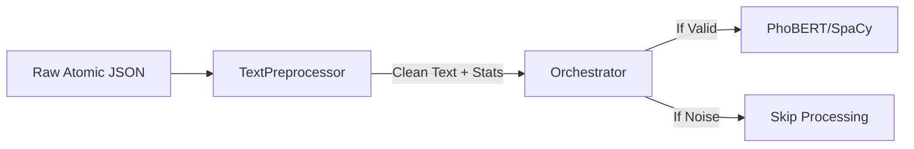

# Implement Text Preprocessor

**Change ID**: `implement_text_preprocessor`  
**Status**: Proposal  
**Created**: 2025-11-30  
**Author**: Analytics Engine Team

---

## Problem Statement

In the Analytics Service architecture (see `documents/master-proposal.md`), the AI processing pipeline consists of 5 stages:
1. **Preprocessor** (Normalization & Merging)
2. Intent Classification
3. Keyword Extraction
4. Sentiment Analysis
5. Impact Scoring

Currently, we have the AI models (PhoBERT, SpaCy-YAKE) for stages 3 & 4, but **Stage 1 (Preprocessor) is missing**.

Without Stage 1, the pipeline cannot function because:
- Raw data from MinIO (Atomic JSON) is scattered across `caption`, `transcription`, and `comments`.
- Text contains noise (URLs, emojis, spam) that degrades AI model performance.
- There is no mechanism to "fail fast" or skip low-quality posts before expensive AI inference.

## Proposed Solution

Implement the `TextPreprocessor` module in `services/analytics/preprocessing/text_preprocessor.py` as the **entry point** for the AI pipeline.

This module will strictly follow the **Input/Output Contract** defined in `documents/implement_plan.md` (Section 1.1).

### Role in Pipeline


### Key Responsibilities
1. **Standardize Input**: Merge `transcription` (highest priority), `caption`, and top `comments` into a single text stream.
2. **Clean Data**: Normalize Unicode (NFC), remove URLs/emojis, and handle Vietnamese specifics.
3. **Signal Noise**: Calculate `hashtag_ratio`, `is_too_short`, and `source_breakdown` so the Orchestrator can filter spam.

---

## Scope

### In Scope
- ✅ Implement `TextPreprocessor` class in `services/analytics/preprocessing/`
- ✅ Implement `merge_content` logic (Transcript > Caption > Top 5 Comments)
- ✅ Implement `normalize` logic (Unicode NFC, URL/Emoji removal, Hashtag handling)
- ✅ Implement `calculate_noise_stats` (Length, Ratios, Breakdown)
- ✅ Unit tests matching the exact scenarios in implementation plan

### Out of Scope
- ❌ Orchestration logic (deciding *when* to skip is the Orchestrator's job, this module just provides the stats)
- ❌ AI Model inference (PhoBERT/SpaCy are downstream consumers)
- ❌ Database storage

---

## Technical Design

### 1. Module Location
**Path**: `services/analytics/preprocessing/text_preprocessor.py`

### 2. Input/Output Contract (Strict Adherence)

**Input**: Atomic JSON Fragment
```python
{
    "content": {
        "text": "Xe VinFast VF3 chạy ngon lắm ae ơi... #vinfast",
        "transcription": "Xin chào các bạn, hôm nay mình test xe...",
    },
    "comments": [
        {"text": "Giá bao nhiêu?", "likes": 10},
        # ...
    ]
}
```

**Output**: Preprocessing Result
```python
{
    "clean_text": "xin chào các bạn... xe vinfast vf3...",  # Normalized for AI
    "stats": {
        "total_length": 150,
        "is_too_short": False,
        "hashtag_ratio": 0.05,
        "has_transcription": True
    },
    "source_breakdown": {
        "caption_len": 50,
        "transcript_len": 200,
        "comments_len": 30
    }
}
```

### 3. Class Interface

```python
class TextPreprocessor:
    def __init__(self):
        # Compile regex patterns once
        pass

    def merge_content(self, caption: str, comments: List[Dict], transcription: str) -> str:
        """Priority: Transcript > Caption > Top 5 Comments"""
        pass

    def normalize(self, text: str) -> str:
        """Unicode NFC -> Remove URL/Emoji -> Handle Hashtags -> Lowercase"""
        pass

    def calculate_noise_stats(self, original: str, clean: str) -> Dict:
        """Compute filtering signals"""
        pass

    def preprocess(self, input_data: Dict) -> Dict:
        """Main entry point: Input Dict -> Output Dict"""
        pass
```

---

## Success Criteria

### Functional Requirements
- [ ] TextPreprocessor merges content from caption, transcription, and comments
- [ ] Text normalization removes URLs, emojis, and cleans whitespace
- [ ] Statistics calculated correctly (length, hashtag ratio, etc.)
- [ ] Source breakdown tracks content origins
- [ ] Handles edge cases (empty input, None values, special characters)

### Non-Functional Requirements
- [ ] Unit test coverage > 90%
- [ ] Integration tests with real data samples
- [ ] Processing time < 10ms per post
- [ ] Memory efficient (no large intermediate objects)
- [ ] Well-documented with usage examples

---

## Implementation Plan

See `tasks.md` for detailed breakdown.

**Estimated Effort**: 2-3 days

---

## Dependencies

### Required
- ✅ Python 3.12+
- ✅ Standard library (re, unicodedata, dataclasses)

### Blocked By
- None

### Blocks
- Orchestrator implementation (needs preprocessing)
- Full analytics pipeline (needs preprocessing)

---

## Risks & Mitigations

| Risk | Impact | Mitigation |
|------|--------|------------|
| Vietnamese text handling issues | Medium | Use Unicode NFC normalization |
| Performance with long texts | Low | Optimize regex patterns |
| Edge cases not covered | Medium | Comprehensive test suite |

---

## Alternatives Considered

### Alternative 1: Use External NLP Library (spaCy/NLTK)
**Rejected**: Overkill for simple preprocessing, adds dependency

### Alternative 2: Preprocessing in AI Models
**Rejected**: Violates separation of concerns, not reusable

### Alternative 3: No Preprocessing
**Rejected**: AI models need clean, normalized input

---

## References

- Master Proposal: `documents/master-proposal.md` (Section 4.1)
- Implementation Plan: `documents/implement_plan.md` (Phase 1.1)
- Unicode Normalization: https://docs.python.org/3/library/unicodedata.html
