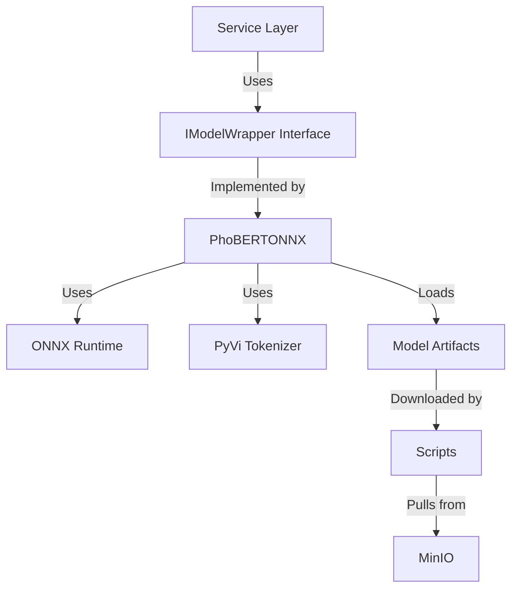

# Design: PhoBERT Integration

## Architecture

The PhoBERT model integration will follow the **Infrastructure Layer** pattern defined in the architecture.

### Component Diagram



## Implementation Details

### 1. Model Wrapper (`infrastructure/ai/phobert_onnx.py`)

The wrapper will encapsulate the complexity of:
1.  **Text Segmentation**: Using `pyvi` to segment Vietnamese text.
2.  **Tokenization**: Using `transformers.AutoTokenizer`.
3.  **Inference**: Using `optimum.onnxruntime.ORTModelForSequenceClassification`.
4.  **Post-processing**: Converting logits to probabilities and 1-5 star ratings.

**Interface**:
```python
class PhoBERTONNX:
    def __init__(self, model_path: str): ...
    def predict(self, text: str) -> Dict[str, Any]: ...
```

### 2. Model Artifacts

The model artifacts (`model_quantized.onnx`, `config.json`, `vocab.txt`, etc.) are large binary files and should **not** be committed to Git. They will be stored in `infrastructure/phobert/models/` and ignored.

### 3. Download Mechanism

A shell script `scripts/download_phobert_model.sh` will handle the download.
*   **Interactive**: Prompts for MinIO IP, Access Key, Secret Key if not provided via env vars.
*   **Tooling**: Uses `mc` (MinIO Client) or `curl`/`wget` if `mc` is not available (or just `curl` to keep it simple as requested "script to download"). *Self-correction: User mentioned "script to download from MinIO selfhost... IP, username... script sh". Using `mc` might be a dependency burden. `curl` or `wget` against MinIO's S3 API or just HTTP if public? User said "bucket name phobert-onnx-artifacts", likely S3 API. I will use `curl` with S3 signature or just ask user to install `mc`? The user said "script... to download". I'll assume `curl` is safer or use a python script if complex auth is needed. Actually, `aws cli` or `mc` is standard. I'll try to use `curl` with a simple approach or ask the user. Wait, user said "IP, username... to input". I will write a script that uses `mc` if available, or maybe just `curl` if I can construct the request. Actually, `minio` usually requires AWS-like signature. A python script using `boto3` or `minio` library might be easier, but user asked for `script sh`. I will stick to a shell script that might use `mc` (MinIO Client) as it's the standard way. Or I can use `curl` with basic auth if it's just a download link? No, it's a bucket. I'll assume `mc` is the way or I'll use a python script wrapped in sh.*
*   *Re-reading user request*: "tạo một script để tải từ MinIO sefthost... script sh". I will use `curl` with a simple S3-compatible signature calculation or just assume `mc` is installed. Actually, creating a python script `scripts/download_model.py` and calling it from `scripts/download_phobert_model.sh` might be more robust for auth. But I'll stick to a bash script that prompts for info and uses `mc` (alias set) to download.

## Dependencies

*   `optimum[onnxruntime]`
*   `transformers`
*   `pyvi`
*   `torch` (for tensor operations as shown in README)
